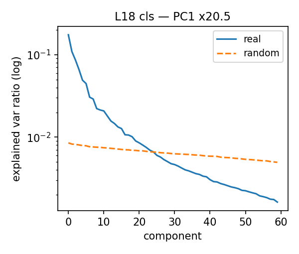
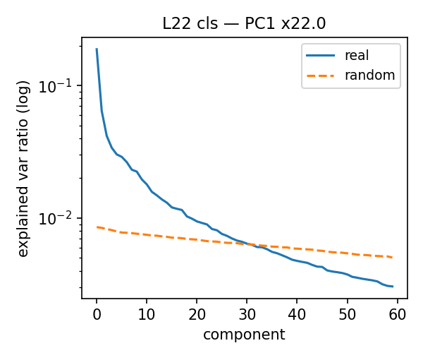
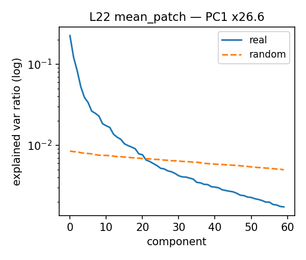
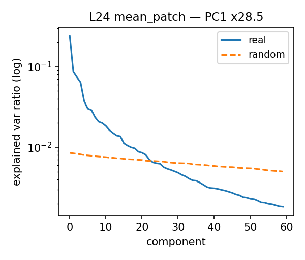
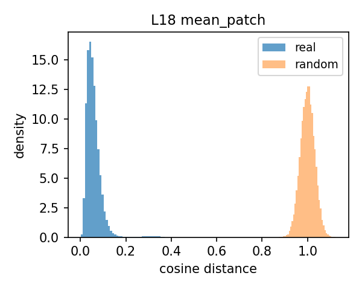
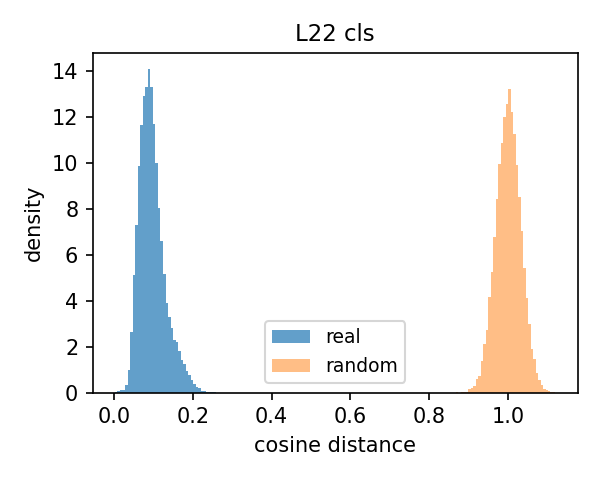
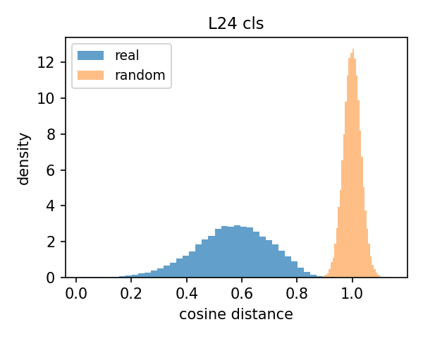
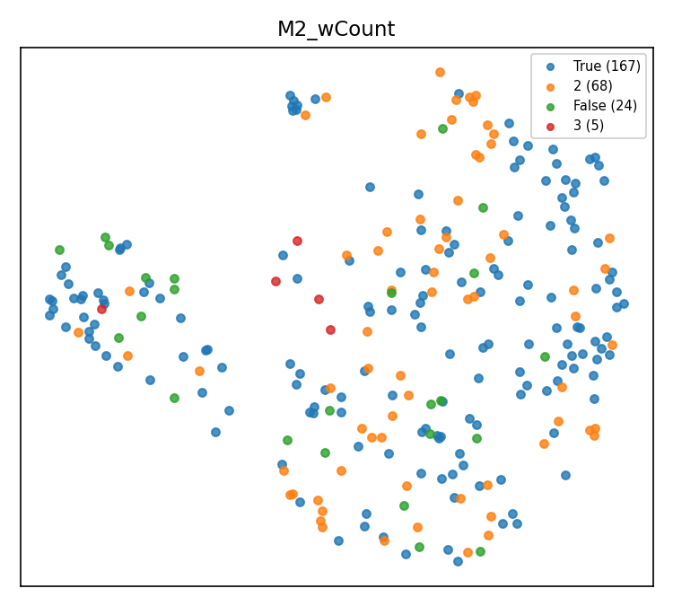
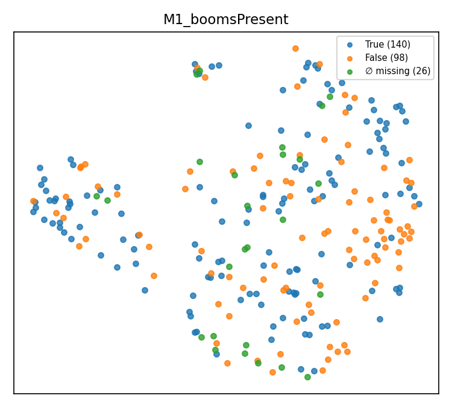
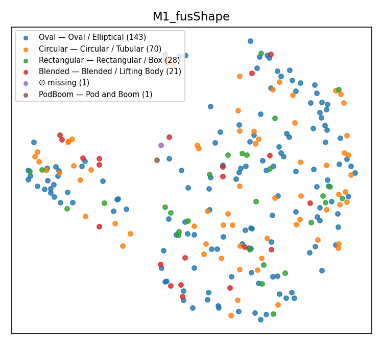

# eVTOL Patent Taxonomy & Embedding Structure — Progress Report

**Prepared for:** Phase Supervisor
**Pipeline stage:** `21_structure_clustering.ipynb` (Batches 01 + 05, 1639-patent dataset), model `facebook/dinov2-large` (frozen), layers {18, 22, 24} × pooling {cls, mean_patch}

Split out of the original combined <code>Supervisor_Report_Taxonomy_Structure_Analysis.md</code> (Sections 3-5) — this document covers everything that requires BOTH labels and embeddings jointly. Label-only batch reconciliation moved to repo 2's <code>10b_label_analysis_report.md</code>; embedding QC and layer/pooling selection moved to repo 2's <code>12a_qc_report.md</code>.

---

## Section 3: Global Embedding Structure vs. Random Noise

<strong>What this stage checks:</strong> whether the frozen DINOv2 embeddings encode genuine geometric structure, or are statistically indistinguishable from random noise — tested via PCA concentration and pairwise-distance comparison against a random baseline, across all 6 layer/pooling matrices.

### 3.1 PCA Structure Across Layers 18–24, cls vs. mean_patch

**Table 6.** PCA structure across layers 18–24, cls vs. mean_patch.

| Layer | Pooling | PC1 variance ratio vs. random | Effective dim | Dims for 90% var |
|---|---|---|---|---|
| 18 | cls | 20.43× | 15.7 | 52 |
| 18 | mean_patch | 25.42× | 12.2 | 51 |
| 22 | cls | 22.01× | 20.2 | 61 |
| 22 | mean_patch | 26.57× | 12.1 | 57 |
| 24 | cls | 18.27× | 26.0 | 61 |
| 24 | mean_patch | **28.49×** | 12.1 | 57 |

`mean_patch` pooling consistently shows a stronger single dominant direction (higher PC1 ratio) than `cls`, while `cls` pooling spreads variance across more effective dimensions (higher participation ratio) — i.e. mean-patch embeddings are more concentrated, cls embeddings are more diffuse.

### 3.2 Pairwise Cosine Distance: Real Embeddings vs. Random Baseline

The pipeline's random baseline is a Gaussian-noise matrix of identical shape (N×1024) to each real embedding matrix; PC1 variance ratio (table above) is the primary real-vs-random test, all values comfortably clear the pipeline's >3× pass threshold.

**Figure 2. PCA spectrum, real vs. random (per layer/pooling):**

<figure><figcaption>L18 cls</figcaption></figure>
<figure><figcaption>L18 mean_patch</figcaption></figure>
<figure><figcaption>L22 cls</figcaption></figure>
<figure><figcaption>L22 mean_patch</figcaption></figure>
<figure><figcaption>L24 cls</figcaption></figure>
<figure><figcaption>L24 mean_patch</figcaption></figure>

**Figure 3. Pairwise cosine-distance distribution, real vs. random (per layer/pooling):**

<figure><figcaption>L18 cls</figcaption></figure>
<figure><figcaption>L18 mean_patch</figcaption></figure>
<figure><figcaption>L22 cls</figcaption></figure>
<figure><figcaption>L22 mean_patch</figcaption></figure>
<figure><figcaption>L24 cls</figcaption></figure>
<figure><figcaption>L24 mean_patch</figcaption></figure>

### 3.3 Structural Integrity Conclusion

All 6 matrices pass real-vs-random on PC1 concentration (18–28× the random baseline) and show non-trivial local structure (Hopkins ≈ 0.66–0.72, i.e. clearly non-uniform but a smooth continuum rather than sharply separated islands). **Embeddings encode genuine geometric structure, not noise** — but the Hopkins score alone only says the structure is *shaped* like a continuum, not what that continuum is *made of*. That content question is only answered downstream: Section 4.1's branch-level spot-check finds at least one branch (branch 13) grouped by rendering/drawing style rather than aircraft design, and Section 4.3 quantifies drawing perspective as a genuine confound (ARI 0.288, comparable to the strongest real design signal found). Taken together, those two results are what justify reading part of this continuum as drawing-style variation rather than purely design variation — this section's own PCA/Hopkins numbers do not by themselves show that.

**Status:** PASSED (real-vs-random test). **Core finding:** all 6 matrices clear the pipeline's ≥3× threshold by a wide margin (PC1 concentration 18–28× the random baseline), proving the embeddings encode genuine geometric structure rather than statistical noise. The shape of that structure matters for what follows: Hopkins scores of 0.66–0.72 describe a smooth continuum, not sharply separated islands — so Section 4 should be expected to find coarse, gradient-like groupings rather than crisp clusters, which is exactly what it finds. (What that continuum is made of — design signal vs. drawing style — is a separate question this section cannot answer on its own; see the drawing-style evidence surfaced in Sections 4.1 and 4.3.)

REAL-VS-RANDOM TEST — PASSED

---

## Section 4: Unsupervised Image-Level Clustering

<strong>What this stage checks:</strong> whether unsupervised clustering of the embeddings recovers meaningful aircraft-design groupings, or just superficial drafting/applicant style — by clustering the reference matrix and testing which taxonomy attributes (vs. which confounds) best align with the resulting clusters.

*Using layer 22, mean_patch pooling — the pipeline's configured reference matrix (repo 2's `12a_qc_report.md`, Section 1.3).*

### 4.1 Hierarchical Dendrogram

Purpose: visualize how the 264 embedded architectures group hierarchically, as a first qualitative look before any cluster count is chosen.

Ward-linkage agglomerative clustering (`scipy.cluster.hierarchy`, `method="ward"`) over the 264-figure, layer-22-mean_patch matrix (reduced via PCA to 57 dims per Section 3):

<figure class="single"><figcaption><strong>Figure 4.</strong> Dendrogram, labeled 1–14 at the cut used for the branch folders below</figcaption></figure>

**Branch-level image folders:** the tree was cut at Ward linkage distance 0.60, which is where it splits into exactly **14 branches** (a strict cut at 0.47 gives 21 branches instead, since the natural split points on this tree don't line up with round numbers — 0.60 was chosen to hit 14 exactly). Each labeled branch above corresponds to a folder of that branch's actual main images, for visual auditing:

`docs/dendrogram_clusters/cluster_01/` … `cluster_14/`, one subfolder per branch, containing that branch's main-image files (branch sizes range from 1 to 43 images; exact counts in `cluster_sizes.json` in the same folder).

**Visual spot-check of the branches.** Opening representative images from several branches confirms genuine visual consistency, though the common thread differs by branch:

- **Branches 1 and 2** are each internally consistent in drawing perspective, not aircraft design — the common thread within each branch is the viewpoint the figure was drawn from (e.g. same-perspective renders grouped together), not a shared design configuration. Separately, each branch also happens to contain images with similar internal structure/layout to each other, but that consistency tracks perspective, not design.
- **Branch 7** is consistent on a "cruise" configuration: a similar fuselage and main wing shape across its images, with mostly just 2 tilting propulsors rather than many boom-mounted rotors.
- **Branch 14** is the same cruise-style configuration as branch 7, but with more propulsors.
- **Branch 13** is consistent on drawing style, not aircraft configuration: its images are rendered in grayscale/shaded CAD style (solid shaded surfaces) rather than the black-and-white line art used almost everywhere else in the dataset — the branch is really grouping by rendering style, not by design.

That last point echoes the drawing-perspective confound already flagged quantitatively in Section 4.3 (ARI 0.288) — branch 13 is a visual instance of the same effect: an aircraft's drafting/rendering style can pull it into a cluster independent of its actual design.

### 4.2 Dimensionality Reduction Comparison

Purpose: find and validate the actual cluster count/algorithm (k-means, agglomerative, HDBSCAN) that Sections 4.3–4.4 will test against the taxonomy.

**Conclusions up front:** three things come out of this stage. (1) The embedding space supports a **coarse, stable 2-way split** — every algorithm agrees that k=2 is the best-supported partition (agglomerative silhouette 0.254, k-means 0.197), and that partition is reproducible under resampling (bootstrap ARI 0.724). (2) There is **finer structure below the 2-way split, but it is fragile** — HDBSCAN finds 5 denser sub-groups, at the cost of labeling 43% of images as noise; silhouettes for k = 3–10 all drop below 0.14, so no clean mid-scale cluster count exists in this space yet. (3) Visually, the UMAP projections show the taxonomy attributes are **spread as gradients rather than islands** — colors mix and shade into each other rather than occupying separate regions, matching the "smooth continuum" verdict from Section 3's Hopkins scores.

The projections below are UMAP (2-D layouts of the 264 embeddings, `n_neighbors=15`, `min_dist=0.1`, cosine metric). Two colorings of the *same* layout are shown: (a) by unsupervised cluster assignment — this shows what the clustering algorithms actually found; and (b) by taxonomy attribute — this shows whether human-labelled design categories occupy coherent regions of the space. Reading them side by side is the point: if a taxonomy attribute's colors separate along the same boundary the clusters found, that attribute is a candidate explanation for the cluster split.

**Figure 5. UMAP colored by unsupervised cluster** (k-means k=2, and HDBSCAN):

<figure><figcaption>UMAP — kmeans k=2</figcaption></figure>
<figure><figcaption>UMAP — HDBSCAN</figcaption></figure>

The k-means view shows the 2-way split as a left/right frontier (90 vs. 174 images). The HDBSCAN view shows where the *dense cores* are: its largest cluster (129 images) occupies the same right-hand region as one k-means cluster, while the gray "noise" points (114) fill the diffuse space between cores — visual confirmation that the fine structure is real but sparse.

**Figure 6. UMAP colored by taxonomy attribute** (`G1_topType`, `M2_wCount`, `M2_wingConf`, `M1_boomsPresent`, `M1_fusShape`, `M1_gearArch`):

<figure><figcaption>G1_topType</figcaption></figure>
<figure><figcaption>M2_wCount</figcaption></figure>
<figure><figcaption>M2_wingConf</figcaption></figure>
<figure><figcaption>M1_boomsPresent</figcaption></figure>
<figure><figcaption>M1_fusShape</figcaption></figure>
<figure><figcaption>M1_gearArch</figcaption></figure>

No single attribute cleanly reproduces the cluster boundary on its own — the coloring is mixed everywhere, which is why the quantitative alignment test in 4.3 (rather than visual inspection) is needed to rank which attributes actually track the split.

**Clustering sweep detail:** across k-means / agglomerative / HDBSCAN with k = 2..10, **agglomerative k=2 (silhouette 0.254)** is the best overall; k-means k=2 is close behind (0.197); HDBSCAN settles on 5 clusters with a high noise fraction (0.432, silhouette 0.149) — density-based clustering finds more structure once every architecture is included, but at the cost of calling nearly half the dataset "noise." Bootstrap cluster stability (ARI) = 0.724 for the k-means k=2 partition (up from 0.70 in the main-arch-only run).

### 4.3 Cluster ↔ Taxonomy Alignment (architectures)

Purpose: the key confound test — check whether the clusters found in 4.2 track real design attributes more strongly than they track nuisance factors like applicant identity or drawing perspective.

**The two metrics used here, briefly.** **NMI (Normalized Mutual Information, 0–1)** measures how much knowing an attribute's category (e.g. "this aircraft has a pusher propulsor") reduces uncertainty about which cluster an image landed in — 0 means the attribute tells you nothing about cluster membership, 1 means it determines it completely. Its weakness: it is *not* corrected for chance, so an attribute split into many small categories can score well above 0 by accident. **ARI (Adjusted Rand Index)** measures the same kind of agreement but *is* chance-corrected — 0 is exactly what random labeling would produce, and it can go negative for worse-than-random agreement. Reading the two together is what makes the table trustworthy: high NMI + comparable ARI = real signal; high NMI + near-zero ARI = statistical artifact.

**The "categories / N" column** reads as *(number of possible label values for that attribute) / (number of images that actually carry a non-null value for it)* — e.g. `M3_emp_chord` is `2 / 39`: only 2 possible values ("Front"/"Back"), and only 39 of the 264 embedded images even have this attribute populated, because many taxonomy fields only apply to a subset of aircraft (here, only aircraft with an empennage-mounted propulsor at all). This ratio is precisely what drives NMI's chance-inflation problem: the more label values squeezed into fewer labelled images, the higher NMI drifts on its own.

Best-aligning taxonomy attributes to the 2-cluster (k-means) partition, out of 79 attributes tested:

**Table 7.** Best-aligning taxonomy attributes vs. confounds, 2-cluster (k-means) partition.

| Attribute | NMI | ARI (chance-corrected) | Categories / N labelled | What it is |
|---|---|---|---|---|
| **M3_emp_chord** | **0.260** | 0.218 | 2 / 39 | Whether the empennage-mounted propulsor faces forward or back — puller ("Front") vs. pusher ("Back") configuration. |
| M3_emp_zone | 0.235 | 0.123 | 5 / 41 | Where on the empennage that propulsor sits — tip-mounted, stacked vertically, or stacked horizontally. |
| M3_boom_t2_count | 0.145 | −0.013 | 9 / 94 | Number of secondary (type-2) propulsion units mounted on the boom, per boom. |
| M2_wing1_posV | 0.139 | 0.210 | 4 / 211 | Vertical mounting position of the main wing on the fuselage — high/shoulder, mid, or low. |
| M1_boom1_circSym | 0.135 | 0.109 | 2 / 111 | Whether the primary boom is circumferentially symmetric (round cross-section) or not. |
| *assignee (confound)* | 0.207 | **0.036** | **109 / 264** | Patent applicant/company — a drafting-style confound, not a design attribute. |
| *drawing perspective (confound)* | 0.201 | 0.288 | 6 / 264 | The figure's viewpoint (front, side, top, isometric, ...) — reflects how the patent was drawn, not the aircraft's design. |
| *assignee_country (confound)* | 0.169 | 0.182 | 19 / 261 | Applicant's country of origin — another drafting/institutional confound. |

Cross-referencing the NMI and ARI columns exposes which signals are real and which are artifacts:

- **Assignee (statistical mirage):** having 109 distinct companies across only 264 patents (many appearing just once or twice) inflates its NMI to 0.207. However, its ARI is a mere 0.036, proving the real agreement with clusters is practically zero.
- **M3_boom_t2_count (false positive):** shows a positive-looking NMI (0.145) but a negative ARI (−0.013), meaning it actually aligns worse than random chance.
- **M3_emp_chord (real signal):** with only 2 categories over 39 patents, its ARI (0.218) closely tracks its NMI (0.260). There is no cardinality inflation here; the signal is legitimate.
- **Drawing perspective (genuine confound):** with only 6 categories, its ARI (0.288) is actually higher than its NMI (0.201). This is a genuinely strong relationship, not a mathematical artifact — and, being higher even than `M3_emp_chord`'s ARI, it's the one most worth explicitly controlling for before treating cluster membership as a clean design signal (see next steps).

### 4.4 Intra- vs. Inter-Class Distances (Stage 5 — layer comparison)

Purpose: a finer-grained, per-attribute test (independent of any specific cluster count) of whether same-class patents sit closer together in embedding space than different-class patents, and which layer/pooling separates classes best.

`structure_clustering.stage5_distances` tests, per taxonomy attribute and per layer×pooling matrix, whether images sharing the same category value sit closer together in embedding space than images from different categories. **The separation ratio is the mean between-class cosine distance divided by the mean within-class cosine distance**: a ratio of 1.0 means same-class images are no closer to each other than to anything else (the attribute is invisible to the embedding), while e.g. 1.54 means different-class pairs are on average 54% farther apart than same-class pairs. Cohen's d expresses the same gap as a standardized effect size, and the permutation p-value checks it isn't a shuffling accident. Across all 264 figures × 79 attributes tested (492 attribute×layer rows total): **174 rows separate significantly at p < 0.05** (excluding the `cluster` label itself).

One row in this test is not a taxonomy attribute: **`cluster` is the unsupervised k-means assignment from Section 4.2**, fed back through the same separation test. It serves as a reference ceiling — since the clusters were *fit* to minimize exactly this kind of within-group distance on the reference matrix, they should separate more strongly than any human label there, and they do (see below). If any taxonomy attribute ever approached the `cluster` row's separation, that attribute would essentially *be* the clustering.

Top individual separations found (excluding the `cluster` label itself):

**Table 8.** Top individual attribute×layer separations (intra- vs. inter-class distance).

| Attribute | Layer | Pooling | Separation ratio | Cohen's d | p-value |
|---|---|---|---|---|---|
| **M1_boom1_circSym** | 22 | mean_patch | 1.543 | 1.248 | 0.001 |
| M1_boom1_circSym | 22 | cls | 1.412 | 1.149 | 0.001 |
| M1_boom1_circSym | 24 | mean_patch | 1.423 | 1.031 | 0.001 |
| M1_boom1_circSym | 18 | mean_patch | 1.415 | 0.911 | 0.004 |
| M3_core_layout_zone | 22 | cls | 1.146 | 0.735 | 0.005 |
| M3_wing1_chord | 22 | cls | 1.263 | 0.726 | 0.009 |

For reference, the unsupervised `cluster` label itself separates most strongly of anything tested on its own reference matrix (layer 22 mean_patch: ratio 1.560, d = 1.03, p = 0.001) — expected, since clustering is fit directly on that matrix.

Averaging Cohen's d over all significant rows per layer×pooling, **layer 22 cls** now has the highest average effect size (mean d = 0.363), ahead of layer 22 mean_patch (0.315) and the other four matrices (0.26–0.30) — a change from the main-arch-only run, where layer 24 cls and layer 18 mean_patch led. With the full architecture set, layer 22 is the strongest performer under both pooling strategies.

**What this means for the reference-matrix choice.** This is the one test in the report that compares all 6 matrices on a taxonomy-relevant criterion, and it does not crown the configured reference matrix: layer 22 **cls** edges out layer 22 mean_patch on average attribute separation (mean d 0.363 vs. 0.315). The honest reading is that the layer-22 *depth* is validated — it wins under both pooling strategies — but the *pooling* choice within layer 22 is genuinely open. Two things temper the case for immediately rerunning Sections 3–4 on layer 22 cls: the margin is modest (≈0.05 in mean d, from a test with its own sampling noise), and this metric measures per-attribute separation, not clustering quality or confound resistance — a matrix can separate attributes slightly better while clustering less cleanly. Since only layer 22 mean_patch has been carried through the full clustering + confound analysis, the principled next iteration is to repeat Sections 3–4 on layer 22 cls (and, given the spread argument from repo 2's `12a_qc_report.md`, layer 24 mean_patch as a secondary candidate) and compare all three on the same criteria: silhouette, bootstrap stability, and NMI/ARI alignment versus confounds. That three-way comparison — not any single metric here — is how the reference matrix should be settled going forward. It is listed as future work rather than done inline, because each rerun regenerates the full stage-3/4/5 artefact set.

**Status:** PASSED (cluster–taxonomy alignment), with a caveat the raw verdict doesn't capture. On NMI — the metric the pipeline's gate actually checks — the best design attribute (`M3_emp_chord`, 0.260) outperforms every confound, which is what the PASS reflects. The chance-corrected view is more nuanced: `M3_emp_chord`'s signal is confirmed real (ARI 0.218 tracks its NMI closely), and the apparent `assignee` threat dissolves under correction (ARI 0.036) — but drawing perspective emerges as a genuinely strong confound (ARI 0.288, above `M3_emp_chord`'s own ARI). **Core finding:** the clusters do carry real design signal, anchored by `M3_emp_chord`, but they are not yet a *clean* design signal — perspective must be controlled for (Section 5, next steps) before cluster membership can be read as design taxonomy alone.

CLUSTER↔TAXONOMY ALIGNMENT — PASSED (WITH PERSPECTIVE CAVEAT)

---

## Section 5: Phase Progress & Next Steps

<strong>What this section is for:</strong> not a new test — it rolls up the pass/fail results from Sections 3–4 (plus repo 2's data-audit and QC reports) into an overall phase status and lists the concrete next steps still open.

**1. Data preprocessing & taxonomy checks — robust.** Two batches (531 approved patents combined), full review/duplicate tracking, zero embedding QC failures (no corrupt/duplicate/dead vectors across 6 layer×pooling matrices, now covering all 264 embedded architectures rather than one per patent). Taxonomy schema (G1/M1/M2/M3 attribute groups, 256 attributes) is wired end-to-end from Excel review sheets through to cluster-alignment testing. See repo 2's `10b_label_analysis_report.md` and `12a_qc_report.md`.

**2. Embeddings show real, non-random geometric structure** (PC1 18–28× random baseline, Hopkins 0.66–0.72) — sufficient to proceed to deeper unsupervised production pipelines. Embedding every architecture (not just each patent's main one) improved the downstream result: the clearest 2-way partition (k-means, silhouette 0.197, stable ARI 0.724) now aligns with a genuine design attribute (`M3_emp_chord`, NMI 0.260, confirmed real by its ARI of 0.218) more strongly than with any confound on the pipeline's NMI gate. The chance-corrected view adds one caveat that must carry into the next phase: drawing perspective's ARI (0.288) exceeds even `M3_emp_chord`'s, making it the confound that must be explicitly controlled before cluster membership is read as pure design signal. Layer 22 mean_patch remains the configured reference matrix, with Section 4.4 flagging layer 22 cls as the candidate to compare against in the next iteration.

**Immediate next steps:**

**1. Fill baseline comparison gaps.** Complete the layer matrix table in repo 2's `12a_qc_report.md`: populate the "Best clustering silhouette" and "Cluster → taxonomy alignment (best NMI)" columns for the other 5 candidate layer/pooling configurations. Currently they are only computed for the reference matrix (layer 22, mean_patch), leaving the baseline comparison incomplete.

**2. Address clustering weaknesses.**
- Optimize HDBSCAN hyperparameters: fine-tune the density-based clustering parameters to reduce the high noise fraction (43.2%), which currently discards nearly half the dataset.
- Implement confound control: explicitly apply residualization to the embeddings before clustering. While the design attribute `M3_emp_chord` (NMI 0.260) beats the confounds on NMI, applicant identity (NMI 0.207, ARI 0.036) and especially drawing perspective (NMI 0.201, ARI 0.288) are strong enough to distort the unsupervised groupings.

**3. Integrate missing data breakdowns.** Add the architecture-type breakdown table using repo 2's `label_analysis.coverage_table` output.

Also worth auditing while this is fresh: the 14 dendrogram branches now each have their own image folder (Section 4.1) — a visual check of whether same-branch images actually look like the same design family would validate (or challenge) the quantitative clustering results above.

SUMMARY — IN PROGRESS

---

All tables/figures sourced from <code>eVTOL-Embedding-Evaluation/notebooks/21_structure_clustering.ipynb</code> and its outputs.
