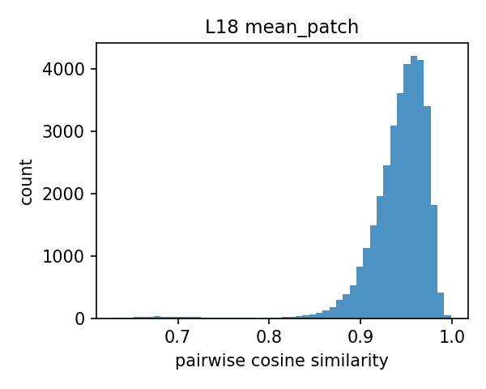
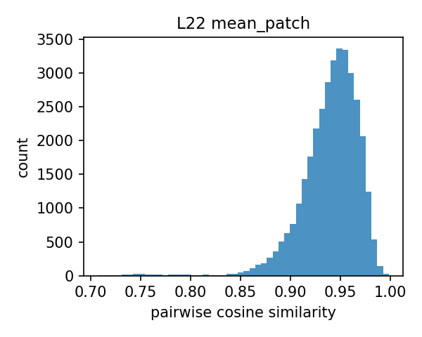
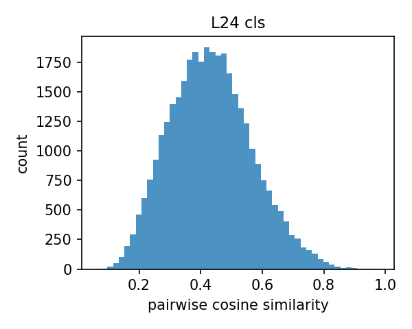
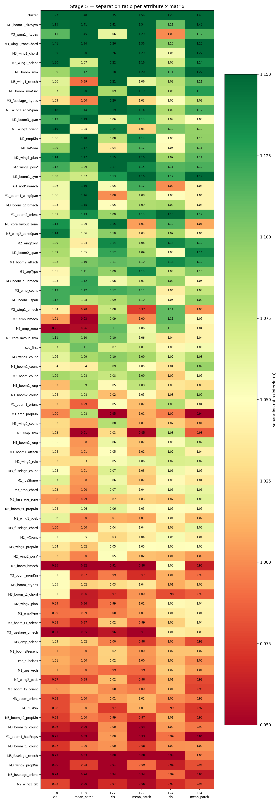

# eVTOL Patent Taxonomy & Embedding Structure — Progress Report

**Prepared for:** Phase Supervisor
**Pipeline stage:** [`21_structure_clustering.ipynb`](../notebooks/21_structure_clustering.ipynb) (Batches 01 + 05, 1639-patent dataset), model `facebook/dinov2-large` (frozen), layers {18, 22, 24} × pooling {cls, mean_patch}

Summary edition of the original combined <code>Supervisor_Report_Taxonomy_Structure_Analysis.md</code>, with Section 5 restored. Supersedes the <code>_summary</code> and <code>_no_section5</code> variants that lived in repo 2 (<code>eVTOL-Embedding-Extraction</code>) before the pipeline split; all figure and output paths below are relative to this repo.

---

## Section 1: Batches & Architecture Baseline Analysis

<strong>What this stage checks:</strong> whether the review spreadsheets and processed manifests agree end-to-end, and which DINOv2 layer/pooling configuration the rest of the report standardizes on.

Sourced from <code>Review_postprocess_Batch_01/05.xlsx</code>, <code>processing_manifest_Batch_01/05.csv</code>, and the notebook's Stage 0 outputs.

### 1.1 Individual and Combined Batch High-Level Summary

**Table 1.** Individual and combined batch high-level summary.

| Metric | Batch_01 | Batch_05 | **Global / Combined** |
|---|---:|---:|---:|
| Total patents reviewed (patent-level, `T1`) | 352 | 211 | **563** |
| Patents disapproved (`isApproved=False`) | 60 | 871 | **147** |
| Patents approved (`isApproved=True`) | 292 | 123 | **415** |
| Total unique Patent IDs reviewed *and approved into the architecture stage* (`T2`)2 | 125 | 95 | **220** |
| Total architecture instances (approved, `T2` "arch" rows) | 3013 | 2303 | **531** |
| `is_main == True` images | 150 | 114 | **264** |

1 One patent in Batch_05 has an unresolved review value; excluded from both counts (123+87+1=211).

2 Lower than "approved" because approved-but-duplicate patents fold into an existing architecture record.

3 Exceeds unique Patent IDs because one patent can disclose multiple aircraft configurations (14 multi-arch patents in Batch_01, 12 in Batch_05) — expected, not a data-quality issue.

**Cross-check:** 264 main images = 268 architectures − 4 with no approved main image. Reconciles exactly. `qc_issues.csv`.

#### Duplicate-Type Definitions

**Table 2.** Duplicate-type definitions and counts.

| Type (as labelled in the data) | Batch_01 | Batch_05 | Plain-language meaning |
|---|---:|---:|---|
| **"1 — Same Aircraft"** | 5 | 6 | Same aircraft/design seen before; `G1`–`M3` equal. |
| **"2 — Images AND aircraft the same"** | 167 | 27 | True exact duplicate; `T2`–`M3` equal. |
| **"3 — Same plane, small changes"** | 10 | – (0) | Minor drawing variations; all taxonomy stages differ. |

Type 2 (true exact duplicate) is the large majority (167/182 Batch_01, 27/33 Batch_05).

### 1.2 Global Batch Pipeline & Data Discrepancy Audit

Purpose: trace where the 563 reviewed patents narrow down to the 264 embedded images.

**Table 3.** Global batch pipeline & data discrepancy audit.

| Pipeline Metric | Value |
|---|---:|
| `is_main == True` images (manifest, both batches) | **264** |
| Total architectures labelled | **268** |
| Base patents behind those architectures | 222 |
| Taxonomy attributes (distinct fields) tracked | **256** |
| Images with a fully aligned embedding | **264** |
| Architectures missing an approved main image | 4 |

#### Reconciling the Counts

**268 vs. 256:** different units, not a discrepancy. 268 = row count (one per architecture). 256 = column count (distinct taxonomy fields). Every row carries all 256 columns. `analysis_taxonomy/stage0/coverage_table.csv`.

**268 vs. 264:** all architecture main images are embedded; the 4 not embedded simply have no approved main image on disk. 268 − 4 = **264**, matching Section 1.1 exactly. `config.yaml: taxonomy.main_arch_only: false`; `qc_issues.csv`; `aligned_rows.csv`.

### 1.3 Optimal Layer and Patch Pooling Strategy Selection

Purpose: compare all 6 candidate DINOv2 layer × pooling configurations and decide which one the rest of the analysis standardizes on.

`G1`/`M1`/`M2`/`M3` are taxonomy schema section codes (topology / fuselage-gear-boom / wing-empennage / propulsion), used downstream as labels against clusters. Baseline comparison across **DINOv2 layers × pooling**, on all 264 embedded images.

**Note:** only 3 of 5 columns are populated for all 6 candidates; silhouette/NMI were only run for layer 22 mean_patch (the bolded row), so this table doesn't show a head-to-head winner — on Hopkins alone, layer 24 cls (0.724) scores higher. The bolded row is what was carried forward, decided by the criteria below the table, not by this table.

**Table 4.** Layer × pooling baseline comparison (all 264 embedded images).

| Layer | Pooling | Effective dim (participation ratio) | Dims for 90% variance | Hopkins (clusterability) | Best clustering silhouette4 | Cluster→taxonomy alignment (best NMI)4 |
|---|---|---:|---:|---:|---:|---:|
| 18 | cls | 15.7 | 52 | 0.683 | — | — |
| 18 | mean_patch | 12.2 | 51 | 0.718 | — | — |
| **22** | **mean_patch** | **12.1** | **57** | **0.687** | **0.197 (k-means, k=2)** | **0.260 (M3_emp_chord)** |
| 22 | cls | 20.2 | 61 | 0.706 | — | — |
| 24 | cls | 26.0 | 61 | **0.724** | — | — |
| 24 | mean_patch | 12.1 | 57 | 0.664 | — | — |

4 Only computed for the reference matrix (layer 22, mean_patch); not run for the other 5. `config.yaml: taxonomy.reference_matrix`.

**Selection Declaration:** **Layer 22, mean-patch pooling** is used for all clustering/alignment work (Sections 3–4). Not derived from Table 4 — on Hopkins alone it's the second-worst of six. Justified instead by the cosine-similarity QC histograms (Table 5): layer 22 mean_patch is the most balanced of the six (mean 0.940, std 0.029), avoiding two failure modes — **too collapsed** (layer 18, mean ≈0.94–0.98, little spread) and **too noisy** (layer 24 cls, mean 0.434, std 0.133, consistent with an unstable final-block `[CLS]` token). Section 4.3 then confirms it in practice: its best-aligning attribute (`M3_emp_chord`, NMI 0.260) beats every confound tested.

**Scope — best available, not proven optimal.** The spread argument cuts both ways: a more spread-out matrix (layer 24) could carry more signal if that spread is structure rather than noise, and that can't be settled from histograms alone. The six matrices were never compared on taxonomy alignment directly — Section 4.4 does that, and in fact finds layer 22 **cls** ahead of layer 22 mean_patch on that criterion. **Treat this selection as provisional**, pending that follow-up comparison.

Set as `taxonomy.reference_matrix` in `config.yaml`.

**Status:** RECONCILED. **Core finding:** every count reconciles exactly (563 → 415 → 268 → 264); layer 22 mean_patch is the working reference matrix, chosen on cosine-spread balance, not proven optimality.

DATA AUDIT — RECONCILED

---

## Section 2: Taxonomy Structure Sanity Check

<strong>What this stage checks:</strong> whether the embeddings are technically sound before drawing conclusions from them — no corrupted, duplicate, or dead vectors, no NaN/Inf, across all 6 matrices.

### 2.1 Embedding QC Matrix (Stage 1)

No corrupted/duplicate/dead embeddings found (N=264 figures):

**Table 5.** Embedding QC matrix — cosine-similarity statistics and integrity checks, per layer/pooling.

| Layer | Pooling | Cosine mean | Cosine std | Cosine p05 | Cosine p95 | Exact duplicates | Near-dead dims | NaN/Inf |
|---|---|---|---|---|---|---|---|---|
| 18 | cls | 0.9758 | 0.0118 | 0.9509 | 0.9896 | 0 | 0 | 0 |
| 18 | mean_patch | 0.9421 | 0.0348 | 0.8908 | 0.9783 | 0 | 0 | 0 |
| 22 | cls | 0.9029 | 0.0333 | 0.8369 | 0.9478 | 0 | 0 | 0 |
| 22 | mean_patch | 0.9398 | 0.0294 | 0.8905 | 0.9761 | 0 | 0 | 0 |
| 24 | cls | 0.4337 | 0.1332 | 0.2263 | 0.6666 | 0 | 0 | 0 |
| 24 | mean_patch | 0.8964 | 0.0417 | 0.8201 | 0.9541 | 0 | 0 | 0 |

Layer 24 cls is the outlier (mean cosine similarity drops to 0.43) — expected for the final block's `[CLS]` token, unstable late in ViT backbones.

<figure><figcaption>L18 cls</figcaption></figure>
<figure><figcaption>L18 mean_patch</figcaption></figure>
<figure><figcaption>L22 cls</figcaption></figure>
<figure><figcaption>L22 mean_patch</figcaption></figure>
<figure><figcaption>L24 cls</figcaption></figure>
<figure><figcaption>L24 mean_patch</figcaption></figure>

<strong>Figure 1.</strong> Cosine similarity histograms per matrix (regenerated as individual panels for legibility)

**How to read:** each panel is pairwise cosine similarity over 500 random pairs (1.0 = identical, 0 = unrelated). Pure QC, not a design-signal check — a histogram near 1.0 (layer 18) means little room for real design differences to show; a wider spread (layer 24 cls) means more room for structure, but also more noise-sensitivity. Whether the spread is real signal is for Sections 3–4 to test.

### 2.2 Sanity Check Validation

**Status:** PASSED. **Core finding:** all 6 matrices technically sound — zero duplicates/dead dims/NaN-Inf, distributions behave as expected per layer depth. Whether the near-1.0 concentration leaves enough *usable* separation is deferred to Sections 3–4.

SANITY CHECK — PASSED

---

## Section 3: Global Embedding Structure vs. Random Noise

<strong>What this stage checks:</strong> whether the embeddings encode genuine geometric structure or are statistically indistinguishable from random noise — via PCA concentration and pairwise-distance vs. a random baseline.

### 3.1 PCA Structure Across Layers 18–24, cls vs. mean_patch

**Table 6.** PCA structure across layers 18–24, cls vs. mean_patch.

| Layer | Pooling | PC1 variance ratio vs. random | Effective dim | Dims for 90% var |
|---|---|---|---|---|
| 18 | cls | 20.43× | 15.7 | 52 |
| 18 | mean_patch | 25.42× | 12.2 | 51 |
| 22 | cls | 22.01× | 20.2 | 61 |
| 22 | mean_patch | 26.57× | 12.1 | 57 |
| 24 | cls | 18.27× | 26.0 | 61 |
| 24 | mean_patch | **28.49×** | 12.1 | 57 |

`mean_patch` pooling shows a stronger dominant direction than `cls`, which spreads variance across more dimensions — mean-patch embeddings are more concentrated, cls more diffuse.

### 3.2 Pairwise Cosine Distance: Real Embeddings vs. Random Baseline

Random baseline = Gaussian noise of identical shape. All 6 matrices comfortably clear the pipeline's >3× pass threshold.

**Figure 2. PCA spectrum, real vs. random (per layer/pooling):**

<figure><figcaption>L18 cls</figcaption></figure>
<figure><figcaption>L18 mean_patch</figcaption></figure>
<figure><figcaption>L22 cls</figcaption></figure>
<figure><figcaption>L22 mean_patch</figcaption></figure>
<figure><figcaption>L24 cls</figcaption></figure>
<figure><figcaption>L24 mean_patch</figcaption></figure>

**Figure 3. Pairwise cosine-distance distribution, real vs. random (per layer/pooling):**

<figure><figcaption>L18 cls</figcaption></figure>
<figure><figcaption>L18 mean_patch</figcaption></figure>
<figure><figcaption>L22 cls</figcaption></figure>
<figure><figcaption>L22 mean_patch</figcaption></figure>
<figure><figcaption>L24 cls</figcaption></figure>
<figure><figcaption>L24 mean_patch</figcaption></figure>

### 3.3 Structural Integrity Conclusion

All 6 matrices pass real-vs-random (PC1 18–28× baseline) and show non-trivial local structure (Hopkins ≈ 0.66–0.72 — a smooth continuum, not sharply separated islands). **Embeddings encode genuine geometric structure, not noise.** What that continuum is *made of* (design signal vs. drawing style) is answered downstream — Section 4.1 finds a branch grouped by rendering style, and Section 4.3 quantifies drawing perspective as a genuine confound (ARI 0.288).

**Status:** PASSED. **Core finding:** all 6 matrices clear the ≥3× threshold by a wide margin, proving real geometric structure. Hopkins scores predict Section 4 will find coarse, gradient-like groupings rather than crisp clusters — which is what it finds.

REAL-VS-RANDOM TEST — PASSED

---

## Section 4: Unsupervised Image-Level Clustering

<strong>What this stage checks:</strong> whether unsupervised clustering recovers meaningful aircraft-design groupings, or just superficial drafting/applicant style.

*Using layer 22, mean_patch pooling — the pipeline's configured reference matrix (Section 1.3).*

### 4.1 Hierarchical Dendrogram

Purpose: visualize how the 264 architectures group hierarchically, before any cluster count is chosen.

Ward-linkage clustering over the 264-figure, layer-22-mean_patch matrix (PCA-57):

<figure class="single"><figcaption><strong>Figure 4.</strong> Dendrogram, labeled 1–14 at the cut used for the branch folders below</figcaption></figure>

**Branch-level image folders:** cut at Ward distance 0.60 → exactly **14 branches** (a strict 0.47 cut gives 21 instead). Each labeled branch has a folder of its actual main images for auditing:

`docs/dendrogram_clusters/cluster_01/` … `cluster_14/` (1–43 images each; `cluster_sizes.json`).

**Visual spot-check:** genuine consistency confirmed, but the common thread differs by branch — **branches 1 and 2** share drawing perspective more than design; **branch 7** shares a "cruise" configuration (similar fuselage/wing, mostly 2 tilting propulsors); **branch 14** is the same cruise style with more propulsors; **branch 13** shares rendering style (grayscale/shaded CAD) rather than design — the same effect as the drawing-perspective confound quantified in Section 4.3 (ARI 0.288).

### 4.2 Dimensionality Reduction Comparison

Purpose: find and validate the cluster count/algorithm that Sections 4.3–4.4 test against the taxonomy.

**Conclusions up front:** (1) a **coarse, stable 2-way split** — every algorithm agrees k=2 is best-supported (agglomerative silhouette 0.254, k-means 0.197, bootstrap ARI 0.724); (2) **finer structure exists but is fragile** — HDBSCAN finds 5 sub-groups at the cost of 43% "noise," and k=3–10 silhouettes all drop below 0.14; (3) taxonomy attributes appear as **gradients, not islands** in UMAP, matching Section 3's "smooth continuum" verdict.

**Figure 5. UMAP colored by unsupervised cluster** (k-means k=2, HDBSCAN):

<figure><figcaption>UMAP — kmeans k=2</figcaption></figure>
<figure><figcaption>UMAP — HDBSCAN</figcaption></figure>

HDBSCAN's largest cluster (129 images) occupies the same region as one k-means cluster; its "noise" points (114) fill the diffuse space between cores.

**Figure 6. UMAP colored by taxonomy attribute** (`G1_topType`, `M2_wCount`, `M2_wingConf`, `M1_boomsPresent`, `M1_fusShape`, `M1_gearArch`):

<figure><figcaption>G1_topType</figcaption></figure>
<figure><figcaption>M2_wCount</figcaption></figure>
<figure><figcaption>M2_wingConf</figcaption></figure>
<figure><figcaption>M1_boomsPresent</figcaption></figure>
<figure><figcaption>M1_fusShape</figcaption></figure>
<figure><figcaption>M1_gearArch</figcaption></figure>

No single attribute cleanly reproduces the cluster boundary — hence the quantitative test in 4.3.

**Clustering sweep:** agglomerative k=2 (silhouette 0.254) best overall; k-means k=2 close behind (0.197); HDBSCAN settles on 5 clusters at 43.2% noise. Bootstrap stability (ARI) = 0.724 for k-means k=2.

### 4.3 Cluster ↔ Taxonomy Alignment (architectures)

Purpose: the key confound test — do clusters track real design attributes more than nuisance factors like applicant identity or drawing perspective?

**NMI** (0–1) measures how much an attribute reduces uncertainty about cluster membership, but is *not* chance-corrected — many small categories can inflate it artificially. **ARI** measures the same agreement but *is* chance-corrected (0 = random, can go negative). High NMI + comparable ARI = real signal; high NMI + near-zero ARI = artifact.

**"Categories / N"** = number of label values / number of images actually carrying that label (many fields only apply to a subset of aircraft). More categories over fewer labelled images drives NMI's inflation problem.

Best-aligning attributes to the 2-cluster (k-means) partition, out of 79 tested:

**Table 7.** Best-aligning taxonomy attributes vs. confounds, 2-cluster (k-means) partition.

| Attribute | NMI | ARI (chance-corrected) | Categories / N labelled | What it is |
|---|---|---|---|---|
| **M3_emp_chord** | **0.260** | 0.218 | 2 / 39 | Whether the empennage-mounted propulsor faces forward or back — puller ("Front") vs. pusher ("Back") configuration. |
| M3_emp_zone | 0.235 | 0.123 | 5 / 41 | Where on the empennage that propulsor sits — tip-mounted, stacked vertically, or stacked horizontally. |
| M3_boom_t2_count | 0.145 | −0.013 | 9 / 94 | Number of secondary (type-2) propulsion units mounted on the boom, per boom. |
| M2_wing1_posV | 0.139 | 0.210 | 4 / 211 | Vertical mounting position of the main wing on the fuselage — high/shoulder, mid, or low. |
| M1_boom1_circSym | 0.135 | 0.109 | 2 / 111 | Whether the primary boom is circumferentially symmetric (round cross-section) or not. |
| *assignee (confound)* | 0.207 | **0.036** | **109 / 264** | Patent applicant/company — a drafting-style confound, not a design attribute. |
| *drawing perspective (confound)* | 0.201 | 0.288 | 6 / 264 | The figure's viewpoint (front, side, top, isometric, ...) — reflects how the patent was drawn, not the aircraft's design. |
| *assignee_country (confound)* | 0.169 | 0.182 | 19 / 261 | Applicant's country of origin — another drafting/institutional confound. |

Cross-referencing NMI and ARI:

- **Assignee (mirage):** 109 companies / 264 patents inflates NMI to 0.207; ARI is 0.036 — real agreement is practically zero.
- **M3_boom_t2_count (false positive):** NMI 0.145 but ARI −0.013 — aligns worse than chance.
- **M3_emp_chord (real signal):** ARI (0.218) tracks NMI (0.260) closely — legitimate.
- **Drawing perspective (genuine confound):** ARI (0.288) is *higher* than its NMI (0.201) — a real, strong relationship, and the one most worth controlling for (see next steps).

### 4.4 Intra- vs. Inter-Class Distances (Notebook Stage 5 — layer comparison)

Purpose: per-attribute test of whether same-class patents sit closer together in embedding space, and which layer/pooling separates classes best.

**Separation ratio** = mean between-class cosine distance ÷ mean within-class distance (1.0 = attribute invisible to the embedding; 1.54 = different-class pairs 54% farther apart). Cohen's d is the standardized effect size; p-value checks it isn't a shuffling accident. Across 264 figures × 79 attributes (492 rows): **174 separate significantly at p<0.05** (excluding `cluster`).

**`cluster`** = the unsupervised k-means assignment fed back through this same test, as a reference ceiling — since clusters were fit to minimize exactly this distance, they should (and do) separate more strongly than any real attribute.

Top individual separations (excluding `cluster`):

**Table 8.** Top individual attribute×layer separations (intra- vs. inter-class distance).

| Attribute | Layer | Pooling | Separation ratio | Cohen's d | p-value |
|---|---|---|---|---|---|
| **M1_boom1_circSym** | 22 | mean_patch | 1.543 | 1.248 | 0.001 |
| M1_boom1_circSym | 22 | cls | 1.412 | 1.149 | 0.001 |
| M1_boom1_circSym | 24 | mean_patch | 1.423 | 1.031 | 0.001 |
| M1_boom1_circSym | 18 | mean_patch | 1.415 | 0.911 | 0.004 |
| M3_core_layout_zone | 22 | cls | 1.146 | 0.735 | 0.005 |
| M3_wing1_chord | 22 | cls | 1.263 | 0.726 | 0.009 |

For reference, `cluster` itself separates most strongly (layer 22 mean_patch: ratio 1.560, d=1.03, p=0.001) — expected.

Averaging Cohen's d per layer×pooling, **layer 22 cls** has the highest effect size (mean d=0.363), ahead of layer 22 mean_patch (0.315) and the rest (0.26–0.30).

<figure class="single"><figcaption><strong>Figure 7.</strong> Separation heatmap</figcaption></figure>

**What this means for the reference matrix:** this is the one test comparing all 6 matrices on a taxonomy-relevant criterion, and layer 22 **cls** edges out layer 22 mean_patch (0.363 vs. 0.315) — the layer-22 *depth* is validated, but the *pooling* choice is genuinely open. The margin is modest and this metric doesn't cover clustering quality or confound resistance, so rerunning Stages 3–4 on layer 22 cls (and layer 24 mean_patch as a secondary candidate) is listed as future work rather than done inline.

**Status:** PASSED, with a caveat. On NMI (the pipeline's actual gate), `M3_emp_chord` (0.260) beats every confound. Chance-corrected: `M3_emp_chord` is confirmed real (ARI 0.218), `assignee` dissolves (ARI 0.036), but drawing perspective is a genuine confound (ARI 0.288, above `M3_emp_chord`'s own). **Core finding:** real design signal exists, but not yet *clean* — perspective must be explicitly controlled for before cluster membership is read as pure design signal.

CLUSTER↔TAXONOMY ALIGNMENT — PASSED (WITH PERSPECTIVE CAVEAT)

---

## Section 5: Phase Progress & Next Steps

<strong>What this section is for:</strong> not a new test — it rolls up the pass/fail results from Sections 1–4 into an overall phase status and lists the concrete next steps still open.

**1. Data preprocessing & taxonomy checks — robust.** Two batches (531 approved patents combined), full review/duplicate tracking, zero embedding QC failures (no corrupt/duplicate/dead vectors across 6 layer×pooling matrices, now covering all 264 embedded architectures rather than one per patent). Taxonomy schema (G1/M1/M2/M3 attribute groups, 256 attributes) is wired end-to-end from Excel review sheets through to cluster-alignment testing.

**2. Embeddings show real, non-random geometric structure** (PC1 18–28× random baseline, Hopkins 0.66–0.72) — sufficient to proceed to deeper unsupervised production pipelines. Embedding every architecture (not just each patent's main one) improved the downstream result: the clearest 2-way partition (k-means, silhouette 0.197, stable ARI 0.724) now aligns with a genuine design attribute (`M3_emp_chord`, NMI 0.260, confirmed real by its ARI of 0.218) more strongly than with any confound on the pipeline's NMI gate. The chance-corrected view adds one caveat that must carry into the next phase: drawing perspective's ARI (0.288) exceeds even `M3_emp_chord`'s, making it the confound that must be explicitly controlled before cluster membership is read as pure design signal. Layer 22 mean_patch remains the configured reference matrix, with Section 4.4 flagging layer 22 cls as the candidate to compare against in the next iteration.

**Immediate next steps:**

**1. Fill baseline comparison gaps.** Complete the layer matrix table: populate the "Best clustering silhouette" and "Cluster → taxonomy alignment (best NMI)" columns for the other 5 candidate layer/pooling configurations in Section 1.3. Currently they are only computed for the reference matrix (layer 22, mean_patch), leaving the baseline comparison incomplete.

**2. Address clustering weaknesses.**
- Optimize HDBSCAN hyperparameters: fine-tune the density-based clustering parameters to reduce the high noise fraction (43.2%), which currently discards nearly half the dataset.
- Implement confound control: explicitly apply residualization to the embeddings before clustering. While the design attribute `M3_emp_chord` (NMI 0.260) beats the confounds on NMI, applicant identity (NMI 0.207, ARI 0.036) and especially drawing perspective (NMI 0.201, ARI 0.288) are strong enough to distort the unsupervised groupings.

**3. Integrate missing data breakdowns.** Add the architecture-type breakdown table: formally generate and embed the table mentioned earlier in these next steps, using the data from `analysis_taxonomy/stage0/coverage_table.csv`.

Also worth auditing while this is fresh: the 14 dendrogram branches now each have their own image folder (Section 4.1) — a visual check of whether same-branch images actually look like the same design family would validate (or challenge) the quantitative clustering results above.

SUMMARY — IN PROGRESS

---

All tables/figures sourced from [<code>notebooks/21_structure_clustering.ipynb</code>](../notebooks/21_structure_clustering.ipynb) (formerly <code>DINOv2_eVTOL_frozen_Analysis/notebooks/11_taxonomy_structure_separation.ipynb</code>). Stage outputs live outside the repo on the sync drive under <code>4 - Intelligence Models &amp; Post Process Outputs/Preliminary_analysis/outputs/</code>: embeddings and Stage-0 QC in <code>analysis_1639_518/</code>, Stage 1–5 tables and figures in <code>analysis_taxonomy/</code>. Figures referenced above are vendored copies in [<code>docs/figs/</code>](figs/); see [ANALYSIS_GUIDE.md](ANALYSIS_GUIDE.md) for metric definitions.
