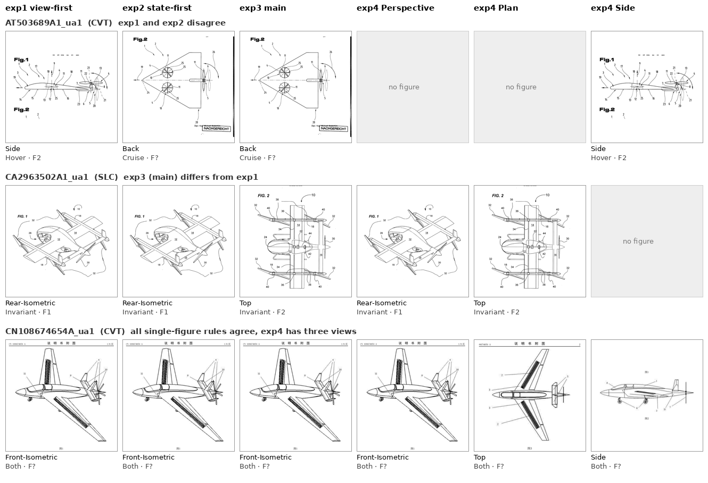

# eVTOL Patent Figures and DINOv2 Embeddings: Progress Report

**Prepared for:** Phase Supervisor  
**Date:** 2026-09-18  
**Material:** 675 aircraft from 583 patents, 1567 whole-aircraft figures (1 639-patent dataset, all five batches)  
**Model:** `facebook/dinov2-large` (frozen), input 518 px, layers {18, 22, 24} × pooling {cls, mean_patch}

Successor of <code>Supervisor_Report_Taxonomy_Structure_Analysis_summary.md</code> (Batches 01 + 05, 264 images, July labels). Same layout and tests, now on the whole labelled dataset. Generated by <code>embedding_evaluation/scripts/build_embedding_analysis.py</code>; every number is computed from the files listed at the end.

---

## Summary

- **Images.** The probes need one vector per aircraft, and most aircraft are drawn more than once. Four rules choose that vector for every one of the 675 aircraft that has a G1 code. Three pick a single figure (by view, by flight state, or the labeller's main figure). The fourth averages one figure per view.
- **How much the rules differ.** View-first and state-first pick the same figure for 96.6 % of aircraft. The labeller's main figure differs from both for 111 aircraft. The view average differs from a single figure for 248 aircraft, the ones drawn in two or three views.
- **Layer.** All six matrices pass the integrity checks. On the taxonomy criterion (same-G1 aircraft closer than different-G1 aircraft), **L24 cls** separates G1 best, averaged over the four rules. The experiment folders currently use L22 cls, so they are to be rebuilt on the winner before the probes.
- **Open.** Which rule and layer predict G1 best is decided by the probes (Section 3). The separation tests of Section 2 rank the options but do not train a classifier.

---

## Section 1: Which Images Are Analysed

<strong>What this section establishes:</strong> which figures enter the embedding analysis, what each figure is labelled with, and the four rules that turn an aircraft's figures into the one vector a probe reads, with how much the rules disagree.

Figure selection: <code>eVTOL-Embedding-Extraction/notebooks/20_figure_selection</code> (gates) and <code>23_view_state_experiments</code> (rules, <code>src/view_state_experiments.py</code>). Rationale of each gate: <code>SELECTION_DECISIONS.md</code>.

### 1.1 From patents to whole-aircraft figures

Purpose: the gates every figure passes before any rule sees it.

The unit is the **aircraft** (`<patent>_ua<N>`): one patent can disclose several aircraft, and the G1 architecture and the main-figure marker are recorded per aircraft. Only approved figures of approved, in-domain aircraft are kept. The domain gate removes aircraft tagged UAV-similar, not electric, or STOL-only. D1 and D2 duplicates repeat an original and are removed, D3 variants stay. Only whole-aircraft figures are kept.

**Table 1. Selection funnel (notebook 20).**

| Step | Figures removed | Figures remaining | Aircraft remaining |
|---|---:|---:|---:|
| figures on file | 0 | 5855 |  |
| figure not approved | 3940 | 1915 | 841 |
| image file missing | 0 | 1915 | 841 |
| patent not approved | 2 | 1913 | 840 |
| no aircraft row | 0 | 1913 | 840 |
| aircraft not approved | 0 | 1913 | 840 |
| domain gate: UAVSimilar | 184 | 1729 | 754 |
| domain gate: ElectricSimilar | 66 | 1663 | 719 |
| domain gate: STOLSimilar | 3 | 1660 | 718 |
| duplicate patent (D1/D2, points at its original) | 74 | 1586 | 677 |
| same image file as another figure row | 1 | 1585 | 677 |
| not a whole-aircraft figure | 18 | 1567 | 677 |

The 2 aircraft marked unclassifiable in G1 have no class and are left out of every rule, which leaves **675 aircraft and 1563 figures**.

### 1.2 What each figure is labelled with

Purpose: the two figure labels the rules sort on, and how they are grouped.

**View.** The eight wizard views are grouped into four. "Generic 3D" is offered in the wizard but has not been used.

**Table 2. Labelled views and their groups (whole-aircraft figures).**

| Labelled view (view8) | View group (view4) | Figures |
|---|---:|---:|
| Front-Isometric | Perspective | 760 |
| Rear-Isometric | Perspective | 78 |
| Top | Plan | 314 |
| Bottom/Down | Plan | 10 |
| Side | Side | 261 |
| Front | FrontRear | 118 |
| Back | FrontRear | 26 |

Aircraft with at least one figure in each group: Perspective 510, Plan 271, Side 195, FrontRear 119.

**Flight state.** Only a convertible aircraft changes shape between hover and cruise, so only there does the flight state of a drawing matter.

- **Fixed types** (RC, MR, SLC, HB, PFV, TB, PTC): every figure is `Invariant`, whatever the label says.
- **Convertible types** (TW, TR, CVT, DS, SRW):
  - `Hover` and `Cruise` are kept as labelled.
  - A figure labelled Invariant, meaning the drawing fits both states, becomes `Both`.
  - Transition and Other become `Other`, and an unlabelled figure is `Missing`.
- **SRW is convertible**, as in the wizard: its rotor stops and serves as the wing in cruise.

**Table 3. Flight state of each figure, by G1 type.**

| G1 | Group | Cruise | Both | Hover | Other | Missing | Invariant | Figures |
|---|---:|---:|---:|---:|---:|---:|---:|---:|
| TR | convertible | 189 | 4 | 196 | 42 | 1 | 0 | 432 |
| CVT | convertible | 123 | 4 | 132 | 19 | 10 | 0 | 288 |
| TW | convertible | 71 | 6 | 77 | 12 | 2 | 0 | 168 |
| SRW | convertible | 9 | 4 | 4 | 1 | 0 | 0 | 18 |
| DS | convertible | 8 | 1 | 4 | 2 | 0 | 0 | 15 |
| SLC | fixed | 0 | 0 | 0 | 0 | 0 | 350 | 350 |
| MR | fixed | 0 | 0 | 0 | 0 | 0 | 107 | 107 |
| TB | fixed | 0 | 0 | 0 | 0 | 0 | 65 | 65 |
| PTC | fixed | 0 | 0 | 0 | 0 | 0 | 41 | 41 |
| HB | fixed | 0 | 0 | 0 | 0 | 0 | 34 | 34 |
| PFV | fixed | 0 | 0 | 0 | 0 | 0 | 23 | 23 |
| RC | fixed | 0 | 0 | 0 | 0 | 0 | 22 | 22 |

**Canonical state: Cruise.** Of 345 convertible aircraft, 215 have a Perspective figure in cruise and 209 one in hover. The margin is small. Cruise also suits the types whose defining feature only shows in forward flight, such as a stopped rotor used as a wing.

LABELS: VIEW AND STATE GROUPED

### 1.3 Four rules for one vector per aircraft

Purpose: how each rule chooses, so a difference in results can be traced to a difference in images.

**Orderings.** Each rule sorts the aircraft's whole-aircraft figures and takes the first.

- **View:** Perspective > Plan > Side > FrontRear.
- **State:** Cruise > Both > Hover > Other > Missing.
- **Ties:** the lowest FIG number wins, then the file name. Crops with no FIG label (`_Fu`) sort last.

**Table 4. The four rules.**

| Rule | How the image is chosen | Vector |
|---|---:|---:|
| exp1 view-first | best view; within it, best state | that figure |
| exp2 state-first | best state; within it, best view | that figure |
| exp3 main | the figure the labeller marked as main | that figure |
| exp4 view average | best figure in each of Perspective, Plan, Side that the aircraft has | mean of 1 to 3 figure vectors, rescaled to length 1 |

exp1 and exp2 use the same two criteria in opposite order. When one figure is best on both, for example a Perspective drawing in cruise, both rules pick it. For fixed types the state never decides, so exp1 and exp2 always agree there. Two side tests place the slot vectors side by side instead of averaging them. They exist only for the aircraft that have every slot (Section 1.5).

**Table 5. Fallbacks (the rule could not apply as written).**

| Rule | Aircraft | What was used |
|---|---:|---:|
| exp3 | US2021309351A1_ua1 | FALLBACK (main figure is not whole-vehicle): exp1's pick |
| exp3 | US6367736B1_ua1 | FALLBACK (main figure is not whole-vehicle): exp1's pick |
| exp4 | ES2555162A1_ua1 | FALLBACK (no Perspective/Plan/Side figure): slot FrontRear: state4=Invariant (rank 0), fig_number=?, of 1 figures |

The two exp3 fallbacks have a part figure as their main and are fixed by marking a whole-aircraft main in the wizard.

### 1.4 How much the picks differ

Purpose: two rules can only score differently on the aircraft where they picked different images.

**Table 6. Same figure picked by two single-figure rules.**

| Pair | Same figure (all) | Aircraft that differ | Same figure (convertible) | Convertible aircraft that differ |
|---|---:|---:|---:|---:|
| exp1 vs exp2 | 96.6 % | 23 | 93.3 % | 23 |
| exp1 vs exp3 | 83.6 % | 111 | 87.0 % | 45 |
| exp2 vs exp3 | 83.6 % | 111 | 87.0 % | 45 |

exp4 uses exactly exp1's figure for the 427 aircraft with a single slot and differs for the 248 drawn in two or three views.

**Table 7. What each single-figure rule picks (views, then states).**

| Rule | Perspective | Plan | Side | FrontRear | state Invariant | state Cruise | state Both | state Hover | state Other | state Missing |
|---|---:|---:|---:|---:|---:|---:|---:|---:|---:|---:|
| exp1 | 508 | 139 | 27 | 1 | 330 | 247 | 6 | 61 | 23 | 8 |
| exp2 | 494 | 136 | 35 | 10 | 330 | 269 | 5 | 43 | 20 | 8 |
| exp3 | 485 | 124 | 39 | 27 | 330 | 249 | 6 | 57 | 25 | 8 |

**Table 8. The 23 aircraft where exp1 and exp2 disagree.**

| exp1 picks | exp2 picks | Aircraft |
|---|---:|---:|
| Perspective + Hover | Side + Cruise | 4 |
| Perspective + Hover | Plan + Cruise | 4 |
| Plan + Hover | Side + Cruise | 4 |
| Perspective + Hover | FrontRear + Cruise | 3 |
| Plan + Hover | FrontRear + Cruise | 3 |
| Perspective + Both | FrontRear + Cruise | 1 |
| Perspective + Other | Plan + Cruise | 1 |
| Perspective + Other | FrontRear + Cruise | 1 |
| Plan + Other | Side + Hover | 1 |
| Side + Hover | FrontRear + Cruise | 1 |

exp1 keeps the better view in a weaker state. exp2 moves to a weaker view to reach a better state, which is Cruise in 22 of the 23 cases.

**Table 9. The 111 aircraft where the main figure differs from exp1: view of each pick.**

| exp3 (main) view | Perspective | Plan | Side |
|---|---:|---:|---:|
| FrontRear | 5 | 16 | 5 |
| Perspective | 48 | 0 | 0 |
| Plan | 11 | 5 | 0 |
| Side | 7 | 10 | 4 |

In 57 of the 111 the labeller's main has the same view as exp1's pick and is another drawing of it. In the rest the labeller preferred a different view.

<figure class="single"><figcaption><strong>Figure 1.</strong> The images each rule uses for three aircraft (row 1, AT503689A1_ua1 (exp1 and exp2 disagree); row 2, CA2963502A1_ua1 (exp3 (main) differs from exp1); row 3, CN108674654A_ua1 (all single-figure rules agree, exp4 has three views)). Captions give the labelled view, the state group and the FIG number.</figcaption></figure>

### 1.5 The view average (exp4)

Purpose: which aircraft the view average actually changes, and for which types it can show an effect.

A single drawing shows one view of the aircraft. The Plan view carries the wing and rotor layout, the Side view the vertical arrangement, the Perspective the overall shape. exp4 averages the views the aircraft has, on the assumption that the aircraft stays recognisable from one view to the next (tested in Section 2.4).

**Table 10. Which slots the aircraft have.**

| Slots the aircraft has | Aircraft |
|---|---:|
| Perspective | 313 |
| Plan | 86 |
| Perspective + Plan | 81 |
| Perspective + Side | 64 |
| Plan + Side | 53 |
| Perspective + Plan + Side | 50 |
| Side | 27 |
| FrontRear only | 1 |

**Table 11. Slots per aircraft, by G1 type.**

| G1 | 0 slots | 1 slot | 2 slots | 3 slots | 2 or 3 slots | Aircraft |
|---|---:|---:|---:|---:|---:|---:|
| SLC | 0 | 123 | 48 | 14 | 62 | 185 |
| TR | 0 | 98 | 45 | 17 | 62 | 160 |
| CVT | 0 | 74 | 31 | 6 | 37 | 111 |
| TW | 0 | 30 | 28 | 2 | 30 | 60 |
| MR | 0 | 30 | 16 | 4 | 20 | 50 |
| TB | 0 | 14 | 10 | 4 | 14 | 28 |
| PTC | 1 | 21 | 3 | 1 | 4 | 26 |
| HB | 0 | 12 | 7 | 1 | 8 | 20 |
| RC | 0 | 8 | 2 | 1 | 3 | 11 |
| PFV | 0 | 7 | 3 | 0 | 3 | 10 |
| SRW | 0 | 4 | 4 | 0 | 4 | 8 |
| DS | 0 | 5 | 1 | 0 | 1 | 6 |

Types with few multi-view aircraft (see the "2 or 3 slots" column) cannot show an effect of the view average. The side tests keep the views apart: Perspective + Plan concatenated for the 131 aircraft that have both, and all three for the 50 that have every slot. They are compared with exp1 on the same aircraft only.

IMAGES: FOUR RULES DEFINED

---

## Section 2: Which Layer

<strong>What this section tests:</strong> the six layer × pooling matrices on integrity, label-free structure, how well they keep same-G1 aircraft together under each rule, whether the drawing's view outweighs the architecture, and whether one aircraft stays recognisable across its views.

Matrices: <code>2_embedding_extraction/embeddings/dinov2-large_518/</code> (notebook 22, 2026-09-17, 1567 figures, vectors L2-normalised). Distances are cosine distances. Pairs from the same patent are left out of every separation test, so two drawings of one patent never count as a match. p-values from 999 label permutations (seed 42).

### 2.1 Integrity and structure against random noise

Purpose: that every matrix is valid and carries more structure than noise (label-free).

Integrity over all 1567 figures: no NaN, Inf, all-zero or duplicate vectors in any matrix.

**Table 12. Label-free structure of each matrix (all figures).**

| Matrix | Cosine mean | Cosine SD | PC1 ÷ random | Effective dims | Dims for 90 % | Hopkins |
|---|---:|---:|---:|---:|---:|---:|
| L18 cls | 0.969 | 0.016 | 51.3 | 16.1 | 72 | 0.757 |
| L18 mean_patch | 0.929 | 0.037 | 69.5 | 12.7 | 79 | 0.77 |
| L22 cls | 0.895 | 0.032 | 50.0 | 27.7 | 186 | 0.731 |
| L22 mean_patch | 0.928 | 0.033 | 58.3 | 14.6 | 94 | 0.757 |
| L24 cls | 0.407 | 0.118 | 37.2 | 40.9 | 272 | 0.736 |
| L24 mean_patch | 0.882 | 0.047 | 62.6 | 16.1 | 99 | 0.753 |

On its first principal component each matrix carries 37.2 to 69.5 times the variance of a random matrix of the same shape (pass bar 3). Hopkins above 0.5 means the vectors clump. These measures describe the matrices and do not use the taxonomy, so they do not decide the layer.

QC AND STRUCTURE: PASSED

### 2.2 Do same-G1 aircraft sit closer together?

Purpose: the taxonomy criterion, for every matrix under every rule.

**Separation ratio** = mean distance between aircraft of different G1 types ÷ mean distance between aircraft of the same type. A ratio of 1.0 means G1 is invisible to the matrix. **Cohen's d** is the same gap in standard deviations. 675 aircraft per cell.

**Table 13. G1 separation: ratio (Cohen's d) per matrix and rule.**

| Matrix | exp1 | exp2 | exp3 | exp4 | Mean d |
|---|---:|---:|---:|---:|---:|
| L18 cls | 1.039 (d 0.08) | 1.039 (d 0.08) | 1.038 (d 0.07) | 1.041 (d 0.08) | 0.077 |
| L18 mean_patch | 1.047 (d 0.09) | 1.049 (d 0.10) | 1.047 (d 0.10) | 1.055 (d 0.10) | 0.098 |
| L22 cls | 1.045 (d 0.13) | 1.043 (d 0.13) | 1.046 (d 0.14) | 1.045 (d 0.12) | 0.129 |
| L22 mean_patch | 1.054 (d 0.12) | 1.053 (d 0.12) | 1.051 (d 0.11) | 1.057 (d 0.12) | 0.119 |
| **L24 cls** | **1.054 (d 0.25)** | **1.052 (d 0.24)** | **1.052 (d 0.24)** | **1.057 (d 0.23)** | **0.242** |
| L24 mean_patch | 1.052 (d 0.13) | 1.051 (d 0.12) | 1.054 (d 0.13) | 1.059 (d 0.13) | 0.129 |

Largest p-value in the table: 0.008.
 **L24 cls** has the highest mean effect over the four rules (0.242). Ranked by mean d over the six matrices, the rules come out as exp1 (0.134), exp3 (0.132), exp4 (0.132), exp2 (0.132). The rules differ by at most 0.002 in mean d, the matrices by 0.165. On this test the layer decides far more than the rule. This is a preview, not the verdict, since the probes measure prediction directly.

### 2.3 Viewpoint against architecture

Purpose: the July report found the drawing's viewpoint separating more strongly than any design attribute. Checked here on every matrix.

The same test on all figures, once with the view group as the label and once with G1. Pairs from the same patent are excluded, so the comparison is between different aircraft only.

**Table 14. Separation by view group and by G1 (all figures, different patents only).**

| Matrix | View ratio | View d | G1 ratio | G1 d | View d ÷ G1 d |
|---|---:|---:|---:|---:|---:|
| L18 cls | 1.198 | 0.36 | 1.033 | 0.06 | 5.6 |
| L18 mean_patch | 1.219 | 0.38 | 1.046 | 0.09 | 4.42 |
| L22 cls | 1.204 | 0.63 | 1.036 | 0.12 | 5.39 |
| L22 mean_patch | 1.254 | 0.51 | 1.044 | 0.1 | 5.28 |
| L24 cls | 1.072 | 0.36 | 1.034 | 0.17 | 2.14 |
| L24 mean_patch | 1.2 | 0.47 | 1.041 | 0.1 | 4.63 |

A "View d ÷ G1 d" above 1 means two drawings in the same view look more alike than two aircraft of the same type. The lowest value is 2.14 (L24 cls) and the highest 5.6 (L18 cls). 6 of the 6 matrices weigh the view more than the architecture, so the view of the image a rule picks can move an aircraft further than its G1 type does.

### 2.4 Does an aircraft stay recognisable across its views?

Purpose: the assumption behind the view average (exp4).

Cosine similarity between the slot figures that exp4 averages. Two views of the same aircraft are compared with two different aircraft in the same view. The gap is expressed in standard deviations of the different-aircraft similarities, because the spread differs from layer to layer.

**Table 15. Same aircraft across views against different aircraft.**

| Matrix | Same aircraft, other view | Other aircraft, same view | Other aircraft, other view | Gap (SD) | cos(exp4, exp1) multi-view |
|---|---:|---:|---:|---:|---:|
| L18 cls | 0.981 | 0.973 | 0.967 | 0.57 | 0.995 |
| L18 mean_patch | 0.944 | 0.94 | 0.924 | 0.13 | 0.985 |
| L22 cls | 0.922 | 0.906 | 0.887 | 0.49 | 0.98 |
| L22 mean_patch | 0.944 | 0.939 | 0.922 | 0.15 | 0.985 |
| L24 cls | 0.526 | 0.436 | 0.387 | 0.77 | 0.867 |
| L24 mean_patch | 0.912 | 0.897 | 0.875 | 0.33 | 0.976 |

A positive gap means that the same aircraft seen from another angle is closer than a different aircraft seen from the same angle. The largest gap is 0.77 SD (L24 cls). The last column shows how far averaging moves the vector away from exp1's single figure for the multi-view aircraft.

### 2.5 Layer declaration

**L24 cls** is carried forward. It separates G1 best averaged over the four rules (Table 13). On the other two criteria it stands as follows. View d ÷ G1 d is 2.14, against a range of 2.14 to 5.6 (Table 14). The across-view gap is 0.77 SD, against 0.13 to 0.77 (Table 15). Its label-free profile is PC1 ÷ random 37.2 and Hopkins 0.736.

The experiment folders were built on L22 cls (the July choice). Before the probes they are rebuilt on L24 cls, a change of one constant in notebook 23 (`PRIMARY_LAYER`, `PRIMARY_POOLING`).
 The choice is provisional: the probes of Section 3 run on every matrix and confirm or overturn it on prediction.

LAYER: PROVISIONAL, PENDING PROBES

---

## Section 3: Open Work

<strong>What remains:</strong> the tests that decide which rule, and which layer, gives the embedding that predicts the architecture best.

1. **Probes.** k-nearest-neighbour and logistic-regression probes predicting G1 from each rule's vectors on all six matrices, with folds grouped by patent and macro-F1 as the score.
   - exp4 is compared with exp1 on the 248 multi-view aircraft only, since the other 427 are identical in both.
   - The side tests are compared with exp1 on their own aircraft.
2. **Small classes.** RC 11, PFV 10, SRW 8, DS 6 have fewer than 20 aircraft. Their scores are reported with that caveat, or merged.
3. **Wizard fixes.**
   - Mark a whole-aircraft main for the two exp3 fallbacks.
   - Check whether KR20240170008A ua1 and ua2 are one aircraft drawn in two states.
4. **224 px.** The 224 px embeddings are not extracted yet. They are needed only for a resolution comparison.

SUMMARY: IN PROGRESS

---

Sources (read-only): <code>1639_LABELLED/2_embedding_extraction/selection/funnel.csv</code> (notebook 20); <code>…/embeddings/dinov2-large_518/</code> (notebook 22); <code>…/view_state_experiments/</code> (notebook 23: figure_table, exp1–exp4 manifests, aircraft_common, exp_embeddings). Every table is also written as CSV to <code>1639_LABELLED/3_embedding_evaluation/embedding_analysis/</code>. Labels: <code>0_labelling/outputs/tables/</code> (notebook 04).
