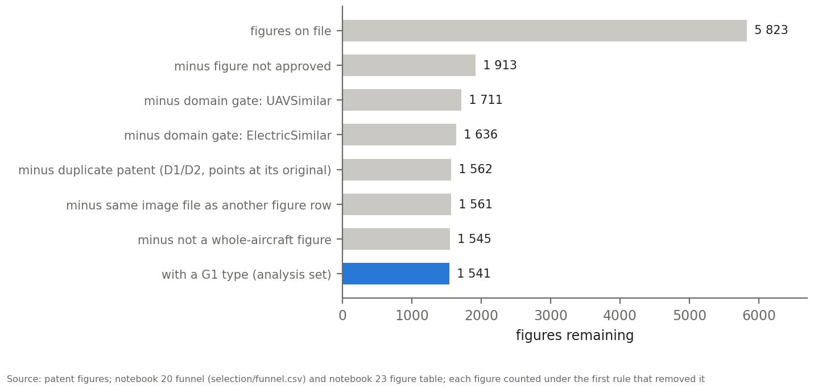
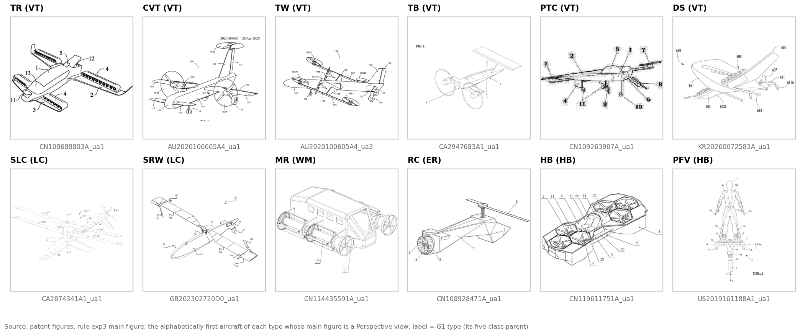
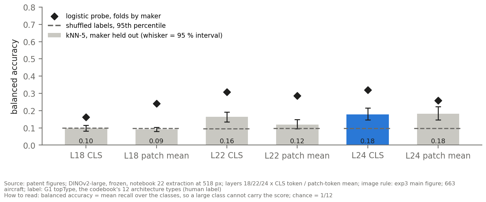
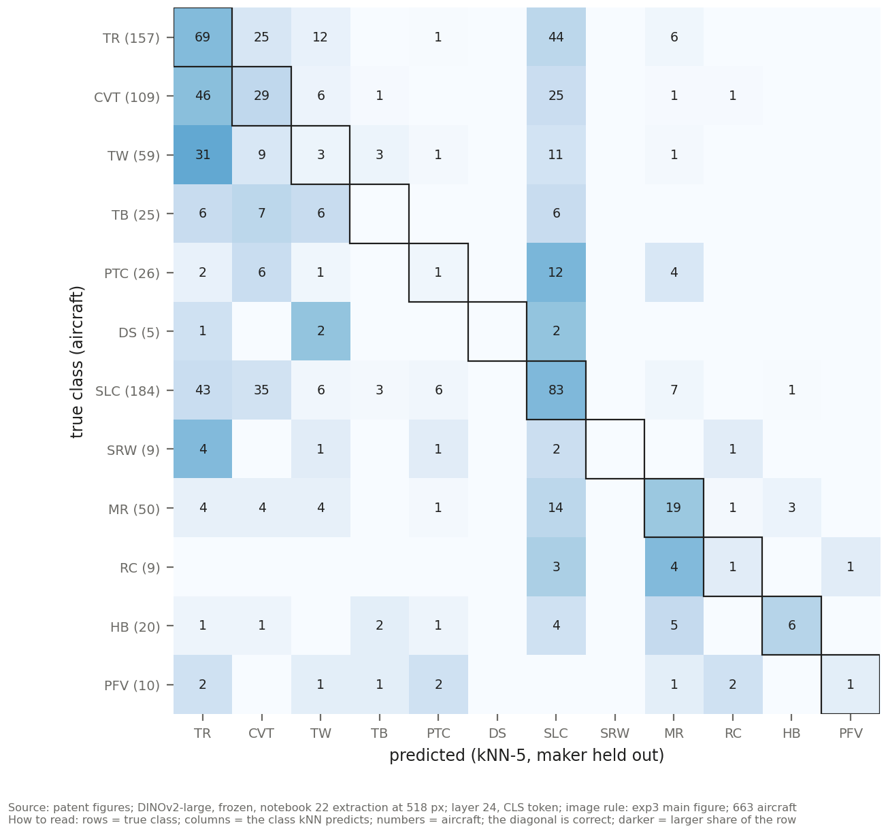
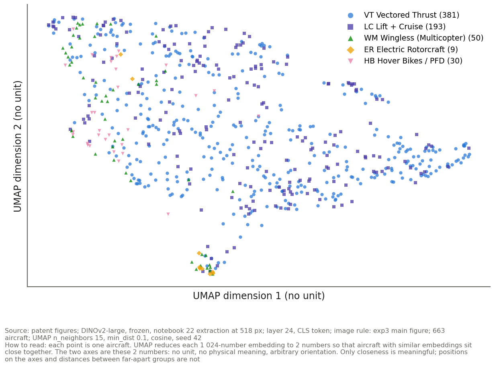
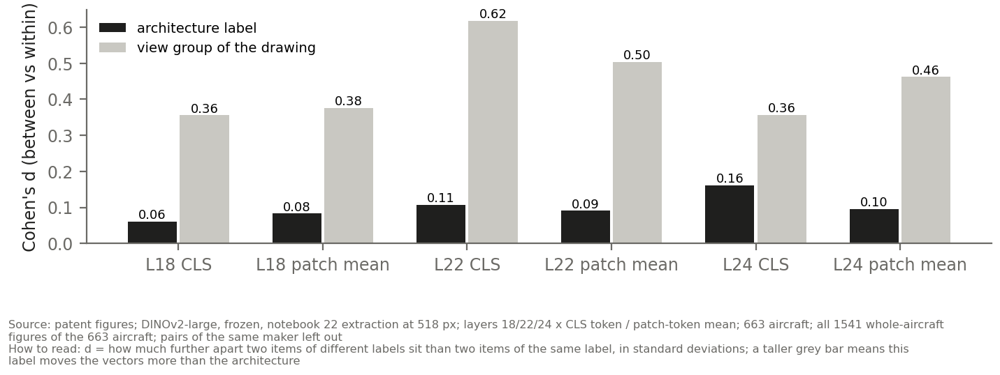
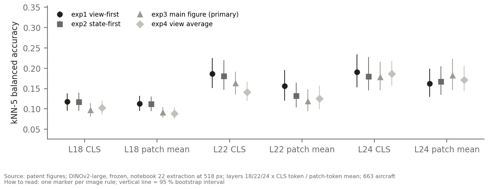
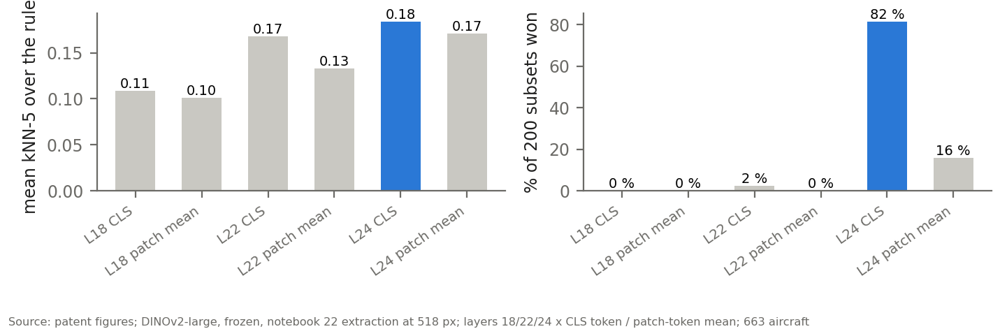

# Patent Figures: DINOv2 Embedding Analysis

**Images:** 663 aircraft from 572 patents (1 639-patent dataset, labelling closed 2026-09-19, domain tags of 2026-09-22)  
**Label:** G1 topType, the codebook's 12 architecture types (human label)  
**Model:** `facebook/dinov2-large`, frozen; 518 px; layers 18, 22, 24 × CLS token / patch-token mean  
**Date:** 2026-09-22

Companion report: <code>EVTOLNEWS_DS/3_embedding_evaluation/embedding_analysis/EVTOLNEWS_EMBEDDING_ANALYSIS.pdf</code> (the same protocol on the evtol.news photos). Supersedes <code>EMBEDDING_ANALYSIS.md</code> of 2026-09-18, which used the labels of that date and scored on separation only.

---

## Summary

| question | result | status |
|---|---|---|
| Are the images the right ones? (Section 1) | human labels; G1 matches the whole-patent reading for 627/662; extraction reproduces (cos ≥ 1.0000) | PASSED |
| Are the embeddings sound? (T1, T2) | no invalid row; PC1 26 to 42 × random | PASSED |
| Do same-class aircraft sit closer? (T3) | yes, weakly: ratio up to 1.049, d up to 0.23 | PASSED, small effect |
| Can the architecture be read? (T4) | L24 CLS: kNN-5 0.18 [0.15, 0.22], probe 0.32; chance 0.08, shuffled 0.10 | PASSED, weak |
| Does it show without labels? (T5) | k-means ARI 0.029 (L24 CLS) | NO |
| What else is encoded? (T6) | view group of the drawing: d ratio 2.21 (L24 CLS) | CAUTION |
| Does the image choice matter? (T7) | rules span 0.18 to 0.19 (L24 CLS) | ROBUST |
| Which layer? | L24 CLS, wins 82 % of random subsets | STABLE |

**Across the two sources.** On the same five classes, with the same protocol and matrix (L24 CLS), the patent figures reach a kNN-5 balanced accuracy of 0.33 [0.28, 0.40] and the evtol.news photos 0.53 [0.50, 0.56] (chance 0.20; probe 0.57 against 0.65). The same model reads the architecture from photographs and renders better than from patent drawings.

**How to read this report.** Section 1 is specific to this source. Sections 2 to 8 apply one protocol, with the same code, parameters and wording, to the patent figures and to the evtol.news photos, each in its own report; a table number in one report answers the same question as in the other. The unit is the aircraft (one vector each). Every test that compares aircraft leaves out pairs and neighbours of the same maker. Six matrices are compared: DINOv2-large (frozen), layers 18, 22 and 24, each as the CLS token and as the mean of the patch tokens, extracted at 518 px.

---

## Section 1: Which Figures Are Analysed, and Is Each Step Sound?

<strong>What this section establishes:</strong> how the patent figures became one vector per aircraft, which setting each step uses and how it was chosen, and the check that shows the step does not decide the result.

The unit is the **aircraft** (`<patent>_ua<N>`): one patent can disclose several aircraft, and the G1 type and the main-figure marker are recorded per aircraft. Every label below is a human label from the labelling wizard (Stage 04 tables of 2026-09-22); no model chooses a figure.

### 1.1 The chain, step by step

**Table 1. The selection chain of the patent figures and the check of each step.**

| step | what it does | setting and how it was chosen | check |
|---|---|---|---|
| 1 Approved figures | keep the figures the labeller approved, of approved in-domain aircraft | human approval in the wizard | every approved figure has its file on disk (0 missing) |
| 2 Domain gate | drop aircraft tagged UAV-similar, not electric (ElectricSimilar) or STOL-only | the Preliminary Analysis gate (user ruling 2026-09-15; tags as of 2026-09-22) | same 665 aircraft as the Preliminary Analysis |
| 3 Duplicates | drop D1/D2 duplicate patents (they repeat an original); keep D3 variants | codebook duplicate rules | each D1/D2 points at an existing original (notebook 04 check) |
| 4 Whole aircraft only | drop part and detail figures | the wizard's parts field | 16 part figures removed; 0 whole-aircraft figures without a view |
| 5 G1 label | keep aircraft with a G1 type; 2 marked unclassifiable are left out | human G1 label | agrees with the whole-patent reading for 627 of 662 aircraft (κ 0.94) |
| 6 One figure per aircraft | four rules pick the figure(s); the main figure is the primary rule | fixed orderings of view and flight state (notebook 23) | Section 7: the score under every rule |
| 7 Processing | rotate by the labelled angle, pad to a white square, resize to 518 px | notebook 21, same code for both sources | 0 processed images older than their source |
| 8 Extraction | DINOv2-large, frozen, layers 18/22/24, CLS token and patch-token mean | notebook 22 | re-extracted today: 1540 figures shared with the 2026-09-17 run, lowest cosine old/new 1.000000 |

<figure class="wide"><figcaption><strong>Figure 1.</strong> From figures on file to the analysis set.Source: patent figures; notebook 20 funnel (selection/funnel.csv) and notebook 23 figure table; each figure counted under the first rule that removed it.</figcaption></figure>

The analysis set holds **663 aircraft from 572 patents** and 1541 whole-aircraft figures. 74 figures leave with duplicate patents, 277 with the domain gate.

<figure class="wide"><figcaption><strong>Figure 2.</strong> One main figure per G1 type, as the model receives it (518 px, padded square).Source: patent figures, rule exp3 main figure; the alphabetically first aircraft of each type whose main figure is a Perspective view; label = G1 type (its five-class parent).</figcaption></figure>

### 1.2 The labels the rules sort on

**View.** The eight wizard views are grouped into four: Perspective (front- and rear-isometric), Plan (top, bottom), Side, Front/Rear. **Flight state** matters only for a convertible type (TW, TR, CVT, DS, SRW), whose shape changes between hover and cruise. For the fixed types every figure is Invariant. On a convertible aircraft Hover and Cruise are kept; a figure labelled Invariant (it fits both states) or Both (the moving part drawn in both positions, added to the wizard on 2026-09-19) becomes **Both**; Transition and Other become Other; an unlabelled figure is Missing.

**Table 2. Flight state of each whole-aircraft figure, by G1 type.**

| G1 | Cruise | Both | Hover | Other | Invariant | figures |
|---|---:|---:|---:|---:|---:|---:|
| TR | 189 | 11 | 197 | 32 | 0 | 429 |
| CVT | 128 | 10 | 133 | 14 | 0 | 285 |
| TW | 77 | 4 | 79 | 7 | 0 | 167 |
| TB | 0 | 0 | 0 | 0 | 57 | 57 |
| PTC | 0 | 0 | 0 | 0 | 41 | 41 |
| DS | 9 | 0 | 3 | 2 | 0 | 14 |
| SLC | 0 | 0 | 0 | 0 | 346 | 346 |
| SRW | 11 | 6 | 4 | 1 | 0 | 22 |
| MR | 0 | 0 | 0 | 0 | 106 | 106 |
| RC | 0 | 0 | 0 | 0 | 17 | 17 |
| HB | 0 | 0 | 0 | 0 | 34 | 34 |
| PFV | 0 | 0 | 0 | 0 | 23 | 23 |

Views: Perspective 822, Plan 323, Side 252, Front/Rear 144. The canonical state for the state-first rule is Cruise, re-checked by notebook 23 on today's labels.

### 1.3 One vector per aircraft: the four rules

**Table 3. The four image rules (notebook 23).**

| rule | which figure |
|---|---|
| exp1 view-first | best view (Perspective > Plan > Side > Front/Rear), then best flight state |
| exp2 state-first | best flight state (Cruise > Both > Hover > Other > Missing), then best view |
| exp3 main figure | the figure the labeller marked as main |
| exp4 view average | mean of the best figure in each of Perspective, Plan and Side |

**Table 4. How often two single-figure rules pick the same figure.**

| pair | same figure | aircraft that differ |
|---|---:|---:|
| exp1 vs exp2 | 96.1 % | 26 |
| exp1 vs exp3 | 83.9 % | 107 |
| exp2 vs exp3 | 83.4 % | 110 |

exp4 averages 1 slot for 416 aircraft (then it equals one figure), 2 for 197 and 3 for 50. 1 aircraft whose main figure is a part figure falls back to exp1's pick (US6367736B1_ua1).

### 1.4 Does the selection decide the result?

The primary score of Section 4 is recomputed after each selection step is made stricter: only the aircraft whose drawing label matches the whole-patent reading (label noise removed), only the aircraft whose main figure is a Perspective view (view held constant), and without the fallbacks.

**Table 5. Sensitivity of the kNN-5 score to the selection (L24 CLS, maker held out).**

| variant | aircraft | kNN-5 | 95 % interval |
|---|---:|---:|---:|
| as built | 663 | 0.178 | 0.15 to 0.22 |
| only aircraft whose drawing label matches the whole-patent reading | 627 | 0.187 | 0.15 to 0.23 |
| only aircraft whose main figure is a Perspective view | 477 | 0.214 | 0.16 to 0.28 |
| without the main-figure fallbacks | 662 | 0.178 | 0.14 to 0.22 |

Every variant stays inside the interval of the full set: no selection step decides the result.

SELECTION: HUMAN LABELS, CHECKED

---

## Section 2: Are the Embeddings Sound? (T1, T2)

<strong>What this section checks:</strong> that every matrix is valid and carries more structure than random noise. Nothing here uses the architecture label.

**Table 6. Integrity and label-free structure, one vector per aircraft (exp3 main figure, 663 aircraft).**

| matrix | cosine mean | cosine SD | PC1 ÷ random | effective dims | dims for 90 % | Hopkins |
|---|---:|---:|---:|---:|---:|---:|
| L18 CLS | 0.970 | 0.015 | 35.0 | 15.7 | 67 | 0.721 |
| L18 patch mean | 0.934 | 0.031 | 41.2 | 14.0 | 75 | 0.707 |
| L22 CLS | 0.897 | 0.033 | 33.8 | 25.7 | 152 | 0.699 |
| L22 patch mean | 0.932 | 0.029 | 39.2 | 14.8 | 85 | 0.699 |
| **L24 CLS** | **0.412** | **0.122** | **26.3** | **36.5** | **203** | **0.712** |
| L24 patch mean | 0.888 | 0.043 | 42.0 | 15.5 | 87 | 0.712 |

Integrity: no row with a NaN, an infinite value or all zeros in the six matrices, and no exact duplicate row. On its first principal component every matrix carries 26 to 42 times the variance of a random matrix of the same shape (pass bar 3). Hopkins lies between 0.70 and 0.72: the vectors clump, but as a continuum and not as separate islands (0.5 would be uniform).

T1 AND T2: PASSED

---

## Section 3: Do Same-Class Aircraft Sit Closer Together? (T3)

<strong>What this section checks:</strong> whether two aircraft of the same class are, on average, closer in the embedding than two aircraft of different classes.

**Separation ratio** = mean cosine distance between aircraft of different classes ÷ mean distance between aircraft of the same class; 1.0 means the class is invisible. **Cohen's d** is the same gap in pooled standard deviations. Pairs of the same maker are left out, so a company's house style cannot count as architecture. p from 999 label permutations.

**Table 7. Class separation, exp3 main figure, label: G1 topType, the codebook's 12 architecture types (human label).**

| matrix | ratio | Cohen's d | p | pairs same class | pairs different class |
|---|---:|---:|---:|---:|---:|
| L18 CLS | 1.037 | 0.072 | 0.016 | 37 971 | 178 869 |
| L18 patch mean | 1.044 | 0.090 | 0.004 | 37 971 | 178 869 |
| L22 CLS | 1.041 | 0.123 | ≤ 0.001 | 37 971 | 178 869 |
| L22 patch mean | 1.046 | 0.106 | ≤ 0.001 | 37 971 | 178 869 |
| **L24 CLS** | **1.049** | **0.227** | **≤ 0.001** | **37 971** | **178 869** |
| L24 patch mean | 1.049 | 0.125 | ≤ 0.001 | 37 971 | 178 869 |

The ratio lies between 1.037 and 1.049, and 6 of 6 matrices separate the classes at p ≤ 0.05. The effect is small in every matrix (largest d 0.23, L24 CLS): the classes overlap heavily on average. Averages over all pairs hide local structure, which the next test measures.

---

## Section 4: Can the Architecture Be Read from the Embedding? (T4)

<strong>What this section checks:</strong> how well the class of an aircraft can be predicted from the classes of its nearest neighbours, and by a linear probe, with the whole maker held out.

**kNN-5 (primary score).** The class of each aircraft is predicted by the majority class of its five nearest aircraft (cosine), never counting an aircraft of the same maker (the applicant's company group, or the first applicant's name for individual inventors). The score is the **balanced accuracy**, the mean recall over the classes, so that a large class cannot carry it; chance is 1/12 = 0.08. The interval is a 95 % bootstrap over the aircraft. **Shuffled labels** give the chance level actually reached by the same neighbours (95th percentile of 200 shuffles). **Probe**: logistic regression, 5 folds grouped by maker.

**Table 8. Prediction of the architecture, exp3 main figure, maker held out (663 aircraft, 12 classes).**

| matrix | kNN-5 | 95 % interval | macro-F1 | shuffled, p95 | probe |
|---|---:|---:|---:|---:|---:|
| L18 CLS | 0.097 | 0.08 to 0.11 | 0.094 | 0.099 | 0.162 |
| L18 patch mean | 0.091 | 0.08 to 0.10 | 0.082 | 0.097 | 0.241 |
| L22 CLS | 0.163 | 0.14 to 0.19 | 0.174 | 0.096 | 0.307 |
| L22 patch mean | 0.119 | 0.09 to 0.15 | 0.127 | 0.096 | 0.287 |
| **L24 CLS** | **0.178** | **0.15 to 0.22** | **0.188** | **0.098** | **0.319** |
| L24 patch mean | 0.183 | 0.15 to 0.22 | 0.187 | 0.097 | 0.258 |

<figure class="wide"><figcaption><strong>Figure 3.</strong> Architecture read from the embedding, per layer and pooling (highlighted: the matrix the layer rule selects).Source: patent figures; DINOv2-large, frozen, notebook 22 extraction at 518 px; layers 18/22/24 x CLS token / patch-token mean; image rule: exp3 main figure; 663 aircraft; label: G1 topType, the codebook's 12 architecture types (human label).<strong>How to read:</strong> balanced accuracy = mean recall over the classes, so a large class cannot carry the score; chance = 1/12.</figcaption></figure>

L24 CLS scores 0.18 (interval 0.15 to 0.22) against a shuffled level of 0.10; the probe reaches 0.32. In 3 of 6 matrices the whole interval lies above the shuffled level. The probe, which weighs every dimension, reads the classes better than the neighbours do (0.32 against 0.18): the architecture is present in the vector, but it is not what decides which aircraft are nearest.

**Table 9. Recall per class, L24 CLS, kNN-5 with the maker held out.**

| class | aircraft | recall |
|---|---:|---:|
| TR | 157 | 0.44 |
| CVT | 109 | 0.27 |
| TW | 59 | 0.05 |
| TB | 25 | 0.00 |
| PTC | 26 | 0.04 |
| DS | 5 | 0.00 |
| SLC | 184 | 0.45 |
| SRW | 9 | 0.00 |
| MR | 50 | 0.38 |
| RC | 9 | 0.11 |
| HB | 20 | 0.30 |
| PFV | 10 | 0.10 |

<figure class="wide"><figcaption><strong>Figure 4.</strong> Which classes are confused with which.Source: patent figures; DINOv2-large, frozen, notebook 22 extraction at 518 px; layer 24, CLS token; image rule: exp3 main figure; 663 aircraft.<strong>How to read:</strong> rows = true class; columns = the class kNN predicts; numbers = aircraft; the diagonal is correct; darker = larger share of the row.</figcaption></figure>

**The same test on the five parent classes.** The evtol.news report can only use the directory's five classes. For a like-for-like comparison, each G1 type is mapped to its parent (TR, CVT, TW, TB, PTC, DS → Vectored Thrust; SLC, SRW → Lift + Cruise; MR → Wingless; RC → Electric Rotorcraft; HB, PFV → Hover Bikes / PFD) and the test is repeated.

**Table 10. Prediction of the five parent classes, same protocol.**

| matrix | kNN-5 | 95 % interval | shuffled, p95 | probe |
|---|---:|---:|---:|---:|
| L18 CLS | 0.198 | 0.18 to 0.22 | 0.216 | 0.377 |
| L18 patch mean | 0.215 | 0.20 to 0.23 | 0.219 | 0.408 |
| L22 CLS | 0.260 | 0.23 to 0.30 | 0.215 | 0.540 |
| L22 patch mean | 0.224 | 0.20 to 0.25 | 0.215 | 0.507 |
| **L24 CLS** | **0.333** | **0.28 to 0.40** | **0.219** | **0.568** |
| L24 patch mean | 0.339 | 0.28 to 0.41 | 0.213 | 0.531 |

On five classes L24 CLS reaches 0.33 (chance 0.20).

---

## Section 5: Does the Structure Follow the Classes Without Labels? (T5)

<strong>What this section checks:</strong> whether a partition found without any label (k-means with as many clusters as classes) matches the classes.

**Table 11. k-means (12 clusters) against the classes. ARI 0 = chance, 1 = identical.**

| matrix | ARI | NMI |
|---|---:|---:|
| L18 CLS | 0.013 | 0.072 |
| L18 patch mean | 0.017 | 0.082 |
| L22 CLS | 0.015 | 0.105 |
| L22 patch mean | 0.022 | 0.100 |
| **L24 CLS** | **0.029** | **0.131** |
| L24 patch mean | 0.024 | 0.110 |

<figure class="wide"><figcaption><strong>Figure 5.</strong> The embedding space of the selected matrix, coloured by the five-class parent of the G1 type.Source: patent figures; DINOv2-large, frozen, notebook 22 extraction at 518 px; layer 24, CLS token; image rule: exp3 main figure; 663 aircraft; UMAP n_neighbors 15, min_dist 0.1, cosine, seed 42.<strong>How to read:</strong> each point is one aircraft. UMAP reduces each 1 024-number embedding to 2 numbers so that aircraft with similar embeddings sit close together. The two axes are these 2 numbers: no unit, no physical meaning, arbitrary orientation. Only closeness is meaningful; positions on the axes and distances between far-apart groups are not.</figcaption></figure>

ARI lies between 0.013 and 0.029. The label-free clusters do not follow the classes: whatever structure the space has, it is not organised by architecture first.

---

## Section 6: What Else Does the Embedding Encode? (T6)

<strong>What this section checks:</strong> whether a property of the image that is not the architecture (view group of the drawing) separates the vectors more strongly than the architecture does.

The T3 separation is computed twice on the same vectors and the same pairs (all 1541 whole-aircraft figures of the 663 aircraft; same-maker pairs left out): once with the architecture as the label, once with the view group of the drawing (Perspective, Plan, Side, Front/Rear). A ratio d(confound) ÷ d(architecture) above 1 means that property moves the vectors more than the architecture.

**Table 12. Architecture against view group of the drawing.**

| matrix | architecture d | view d | view d ÷ architecture d |
|---|---:|---:|---:|
| L18 CLS | 0.061 | 0.356 | 5.82 |
| L18 patch mean | 0.083 | 0.376 | 4.53 |
| L22 CLS | 0.107 | 0.618 | 5.78 |
| L22 patch mean | 0.091 | 0.504 | 5.57 |
| **L24 CLS** | **0.161** | **0.357** | **2.21** |
| L24 patch mean | 0.096 | 0.462 | 4.81 |

<figure class="wide"><figcaption><strong>Figure 6.</strong> What else the embedding encodes: the view group of the drawing against the architecture.Source: patent figures; DINOv2-large, frozen, notebook 22 extraction at 518 px; layers 18/22/24 x CLS token / patch-token mean; 663 aircraft; all 1541 whole-aircraft figures of the 663 aircraft; pairs of the same maker left out.<strong>How to read:</strong> d = how much further apart two items of different labels sit than two items of the same label, in standard deviations; a taller grey bar means this label moves the vectors more than the architecture.</figcaption></figure>

In 6 of 6 matrices the view group of the drawing separates the vectors more than the architecture (ratio 2.21 to 5.82; L24 CLS: 2.21).

---

## Section 7: Does the Choice of Image Matter? (T7)

<strong>What this section checks:</strong> whether the result depends on which figure of each aircraft is used. The T4 score is recomputed under every image rule.

**Table 13. The image rules.**

| rule | which image |
|---|---|
| exp1 view-first | best view (Perspective > Plan > Side > Front/Rear), then best flight state |
| exp2 state-first | best flight state (Cruise > Both > Hover > Other > Missing), then best view |
| exp3 main figure | the figure the labeller marked as main |
| exp4 view average | mean of the best figure in each of Perspective, Plan and Side |

**Table 14. kNN-5 balanced accuracy (maker held out) per image rule.**

| matrix | exp1 view-first | exp2 state-first | exp3 main figure | exp4 view average |
|---|---:|---:|---:|---:|
| L18 CLS | 0.118 | 0.117 | 0.097 | 0.103 |
| L18 patch mean | 0.113 | 0.112 | 0.091 | 0.088 |
| L22 CLS | 0.186 | 0.181 | 0.163 | 0.141 |
| L22 patch mean | 0.156 | 0.132 | 0.119 | 0.125 |
| **L24 CLS** | **0.191** | **0.180** | **0.178** | **0.187** |
| L24 patch mean | 0.162 | 0.167 | 0.183 | 0.172 |

<figure class="wide"><figcaption><strong>Figure 7.</strong> Does the choice of image change the result? The same test under every image rule.Source: patent figures; DINOv2-large, frozen, notebook 22 extraction at 518 px; layers 18/22/24 x CLS token / patch-token mean; 663 aircraft.<strong>How to read:</strong> one marker per image rule; vertical line = 95 % bootstrap interval.</figcaption></figure>

On L24 CLS the rules range from 0.18 to 0.19, a spread of 0.01, against a 95 % interval about 0.07 wide for one rule. The highest score comes from exp1 view-first. The spread is smaller than half the interval: the conclusion does not depend on the image rule.

---

## Section 8: Which Layer? (Layer Rule)

<strong>Rule, fixed before the numbers were read:</strong> the matrix with the highest kNN-5 score (maker held out) averaged over the image rules is carried forward. Robustness: the same choice is repeated on 200 random subsets of 80 % of the aircraft.

**Table 15. Layer rule.**

| matrix | mean kNN-5 over the rules | subsets won |
|---|---:|---:|
| L18 CLS | 0.109 | 0 % |
| L18 patch mean | 0.101 | 0 % |
| L22 CLS | 0.168 | 2 % |
| L22 patch mean | 0.133 | 0 % |
| **L24 CLS** | **0.184** | **82 %** |
| L24 patch mean | 0.171 | 16 % |

<figure class="wide"><figcaption><strong>Figure 8.</strong> Layer rule: the matrix with the best mean score, and how often it stays best when the aircraft change.Source: patent figures; DINOv2-large, frozen, notebook 22 extraction at 518 px; layers 18/22/24 x CLS token / patch-token mean; 663 aircraft.</figcaption></figure>

**L24 CLS** is carried forward. It wins 82 % of the subsets. The choice is stable.

LAYER: L24 CLS

---

## Open Points

1. **Small classes.** DS 5, SRW 9, RC 9, PFV 10 have fewer than 20 aircraft; their recall rests on a handful of aircraft (Table 9).
2. **Wizard.** Mark a whole-aircraft main figure for US6367736B1_ua1; check whether KR20240170008A ua1 and ua2 are one aircraft drawn in two states.
3. **Notebook 23** still writes its experiment folders from L22 CLS (`PRIMARY_LAYER`); this report reads the full matrices and does not depend on it.

---

Generated by <code>embedding_evaluation/scripts/build_embedding_reports.py</code> with <code>src/embedding_protocol.py</code> (the shared protocol) and <code>src/embedding_reports.py</code>. Sources: <code>1639_LABELLED/2_embedding_extraction/</code>: <code>selection/</code> (notebook 20), <code>processed/518/</code> (21), <code>embeddings/dinov2-large_518/</code> (22), <code>view_state_experiments/</code> (23); labels <code>0_labelling/outputs/</code> (notebook 04). Tables as CSV in <code>1639_LABELLED/3_embedding_evaluation/embedding_protocol/</code>.
